# Worked examples

*Generated by `scripts/gen_examples.py` — every example below was actually executed, and every number carries the audit id of the call that produced it. Regenerate with `uv run python scripts/gen_examples.py` (runs against live archives; not a CI step).*

77 worked examples across the six tool families, 16 of them producing the figures embedded here (copied into `docs/examples/`, large images downscaled). Chained inputs — a measure example reading a retrieve example's file — are real chains: the CSVs referenced are the ones the earlier example wrote.

Sections 1–6 cover the tools, section 7 shows where each skill document earns its place, section 8 the Python API of the supporting modules.


## 1. discover (13 tools)

Find out what exists before fetching it: catalog searches, event databases, live conditions.


### 1.1 `get_noaa_realtime`

Current planetary Kp from the SWPC real-time feed. Operational data — quote it as such.

```bash
uv run helio-agent run get_noaa_realtime '{"product": "kp"}'
```
```text
product                      kp
audit_id                     98d0665e7f53
```
*Skills exercised: [`datasources/noaa_swpc.md`](../skills/datasources/noaa_swpc.md)*


### 1.2 `get_solar_regions`

Today's edited sunspot-region summary. `location` is valid at 2400 UT of `observed_date` — match images against `coordinates_epoch`, never the date stamp.

```bash
uv run helio-agent run get_solar_regions '{}'
```
```text
observed_date                2026-09-05
coordinates_epoch            2026-09-06T00:00:00Z
n_results                    10
audit_id                     f15402191d13
```
*Skills exercised: [`datasources/noaa_swpc.md`](../skills/datasources/noaa_swpc.md)*


### 1.3 `get_sunspot_reports`

The raw per-observatory reports behind that summary. Observatories disagree on the McIntosh class for ~65% of region-days; ties are reported, never resolved by fiat.

```bash
uv run helio-agent run get_sunspot_reports '{}'
```
```text
coverage                     ['2026-08-05', '2026-09-05']
n_reports                    10
note                         10 station reports over 1 date(s), 6 region-days. 2 region-day(s) (33%) have observatories disagreeing on t...
audit_id                     fc60a7313b77
```
*Skills exercised: [`datasources/noaa_swpc.md`](../skills/datasources/noaa_swpc.md), [`methods/flare_analysis.md`](../skills/methods/flare_analysis.md)*


### 1.4 `search_cdaweb_datasets`

Keyword search over CDAWeb's ~3000 datasets when you know the physics but not the ID.

```bash
uv run helio-agent run search_cdaweb_datasets '{"keyword": "WAVES radio"}'
```
```text
n_results                    0
audit_id                     569081df3791
```
*Skills exercised: [`datasources/cdaweb.md`](../skills/datasources/cdaweb.md)*


### 1.5 `list_cdaweb_variables`

Variable names and units for a dataset — run before any fetch_cdaweb_data call.

```bash
uv run helio-agent run list_cdaweb_variables '{"dataset": "OMNI2_H0_MRG1HR"}'
```
```text
dataset                      OMNI2_H0_MRG1HR
n_results                    54
audit_id                     0877ac22c456
```
*Skills exercised: [`datasources/cdaweb.md`](../skills/datasources/cdaweb.md), [`datasources/omniweb.md`](../skills/datasources/omniweb.md)*


### 1.6 `search_donki`

DONKI flare records around the 2017-09-06 X9.3 — the standard cross-check for any flare detection.

```bash
uv run helio-agent run search_donki '{"start_date": "2017-09-05", "end_date": "2017-09-08", "kind": "FLR"}'
```
```text
n_results                    20
audit_id                     15442239be4d
```
*Skills exercised: [`datasources/donki.md`](../skills/datasources/donki.md), [`methods/flare_analysis.md`](../skills/methods/flare_analysis.md)*


### 1.7 `search_hek_events`

The same day in the Heliophysics Event Knowledgebase; HEK and DONKI are independent catalogs, which is what makes agreement meaningful.

```bash
uv run helio-agent run search_hek_events '{"start": "2017-09-06T00:00:00", "end": "2017-09-07T00:00:00", "event_type": "FL"}'
```
```text
n_results                    104
audit_id                     9dc8ea610a80
```
*Skills exercised: [`datasources/hek.md`](../skills/datasources/hek.md)*


### 1.8 `search_heliodata`

Freetext search of the HDRL HelioData catalog (>7800 datasets).

```bash
uv run helio-agent run search_heliodata '{"query": "interplanetary magnetic field ACE"}'
```
```text
n_results                    0
audit_id                     eee4a80fe2ed
```
*Skills exercised: [`datasources/heliodata.md`](../skills/datasources/heliodata.md)*


### 1.9 `search_vso`

What the VSO holds for a 20-minute HMI window — search before fetch.

```bash
uv run helio-agent run search_vso '{"start": "2017-09-06T11:00:00", "end": "2017-09-06T11:20:00", "instrument": "HMI"}'
```
```text
n_results                    78
audit_id                     43f780712170
```
*Skills exercised: [`datasources/vso.md`](../skills/datasources/vso.md)*


### 1.10 `list_spacecraft`

Spacecraft trackable through SSCWeb, with the IDs fetch_spacecraft_ephemeris needs.

```bash
uv run helio-agent run list_spacecraft '{}'
```
```text
n_results                    314
audit_id                     aac367af2306
```
*Skills exercised: [`datasources/sscweb.md`](../skills/datasources/sscweb.md)*


### 1.11 `list_pyspedas_missions`

Mission projects pySPEDAS can load.

```bash
uv run helio-agent run list_pyspedas_missions '{}'
```
```text
n_results                    37
audit_id                     542c18c1dc56
```
*Skills exercised: [`tools/pyspedas_pytplot.md`](../skills/tools/pyspedas_pytplot.md)*


### 1.12 `list_pyspedas_loaders`

Instrument load routines for one mission.

```bash
uv run helio-agent run list_pyspedas_loaders '{"mission": "ace"}'
```
```text
mission                      ace
n_results                    10
audit_id                     aaaf2e7a45ff
```
*Skills exercised: [`tools/pyspedas_pytplot.md`](../skills/tools/pyspedas_pytplot.md)*


### 1.13 `list_model_outputs`

CCMC model products on ISWA with live coverage — catalog presence is not currency, so every entry carries a staleness flag read from the server.

```bash
uv run helio-agent run list_model_outputs '{"model": "swmf"}'
```
```text
n_products                   10
n_live                       3
audit_id                     831781ec78ba
```
*Skills exercised: [`datasources/hapi.md`](../skills/datasources/hapi.md)*


## 2. literature (4 tools)

ADS and arXiv access — search, fetch, cite. Used both for context and to source the constants inside tools.


### 2.14 `search_ads`

ADS search that located the flare-rate tables behind flare_probability.

```bash
uv run helio-agent run search_ads '{"query": "title:\"McIntosh\" AND abs:\"flaring rates\"", "max_results": 5}'
```
```text
n_results                    4
audit_id                     19af81582c15
```
*Skills exercised: [`methods/paper_reproduction.md`](../skills/methods/paper_reproduction.md)*


### 2.15 `search_arxiv`

The same hunt on arXiv, which is where the open PDF turned out to live.

```bash
uv run helio-agent run search_arxiv '{"query": "McIntosh sunspot classification flaring rates", "max_results": 5}'
```
```text
n_results                    5
audit_id                     aabc329e77af
```

### 2.16 `fetch_arxiv_pdf`

Download the paper into the workspace. Its Tables 5/7/9 were then parsed into flare_probability's rate tables rather than transcribed by hand.

```bash
uv run helio-agent run fetch_arxiv_pdf '{"arxiv_id": "1607.00903"}'
```
```text
file                         <workspace>/data/arxiv_1607.00903.pdf
audit_id                     f2f2adfb9a20
```

### 2.17 `get_bibtex`

Citable BibTeX for the same paper, from ADS.

```bash
uv run helio-agent run get_bibtex '{"bibcodes": ["2016SoPh..291.1711M"]}'
```
```text
bibtex                       @ARTICLE{2016SoPh..291.1711M,
       author = {{McCloskey}, Aoife E. and {Gallagher}, Peter T. and {Bloomfi...
audit_id                     d8e6fecc4960
```

## 3. retrieve (16 tools)

Every retrieval writes a workspace CSV (naive-UTC index, NaN fills) or a FITS/PNG, and returns the path plus a summary. Downstream tools operate on those files.


### 3.18 `fetch_omni`

Hourly OMNI through the Halloween 2003 superstorm — the repo's oldest validation anchor (Dst -383 nT).

```bash
uv run helio-agent run fetch_omni '{"start": "2003-10-28T00:00:00Z", "end": "2003-11-02T00:00:00Z"}'
```
```text
n_records                    121
columns                      ['ABS_B1800', 'BZ_GSM1800', 'V1800', 'N1800', 'DST1800', 'KP1800', 'Pressure1800']
audit_id                     6f5c66e4cb74
```
*Skills exercised: [`datasources/omniweb.md`](../skills/datasources/omniweb.md)*


### 3.19 `fetch_cdaweb_data`

Any CDAWeb dataset by ID and variable list; here ACE field magnitude, later cross-checked against the same data through pySPEDAS.

```bash
uv run helio-agent run fetch_cdaweb_data '{"dataset": "AC_H2_MFI", "variables": ["Magnitude"], "start": "2017-09-06T00:00:00Z", "end": "2017-09-08T00:00:00Z"}'
```
```text
n_records                    49
columns                      ['Magnitude']
audit_id                     d79b84c18d1b
```
*Skills exercised: [`datasources/cdaweb.md`](../skills/datasources/cdaweb.md)*


### 3.20 `fetch_cdaweb_spectrogram`

A 2-D dynamic spectrum with its frequency axis kept — WIND/WAVES around the X9.3. The generic fetch flattens 2-D variables; this one does not.

```bash
uv run helio-agent run fetch_cdaweb_spectrogram '{"start": "2017-09-06T08:00:00Z", "end": "2017-09-06T20:00:00Z"}'
```
```text
n_records                    240
n_channels                   76
channel_units                Hz
audit_id                     a165c672c828
```
*Skills exercised: [`methods/radio_burst_analysis.md`](../skills/methods/radio_burst_analysis.md)*


### 3.21 `fetch_goes_xrs`

Science-grade GOES X-ray flux for flare work.

```bash
uv run helio-agent run fetch_goes_xrs '{"start": "2017-09-06T00:00:00Z", "end": "2017-09-07T00:00:00Z"}'
```
```text
n_records                    175093
columns                      ['xrsa', 'xrsb']
audit_id                     654505120eda
```
*Skills exercised: [`methods/flare_analysis.md`](../skills/methods/flare_analysis.md)*


### 3.22 `fetch_goes_protons`

Integral proton flux around the 2017-09-10 S3 radiation storm. Before 2020-03 these are measured channels; after, the tool reconstructs them from the SGPS spectrum and says so in `derived`.

```bash
uv run helio-agent run fetch_goes_protons '{"start": "2017-09-09T00:00:00Z", "end": "2017-09-16T00:00:00Z", "satellite": "goes13"}'
```
```text
n_records                    2017
satellite                    goes13
derived                      False
source                       NOAA NCEI GOES/EPEAD cpflux 5m (goes13)
audit_id                     40589b556de2
```
*Skills exercised: [`datasources/goes_ncei.md`](../skills/datasources/goes_ncei.md), [`methods/sep_analysis.md`](../skills/methods/sep_analysis.md)*


### 3.23 `fetch_hapi`

Any HAPI server by URL. `reader` reports whether hapiclient or the direct-CSV fallback served it (ISWA declares a non-spec `float` type).

```bash
uv run helio-agent run fetch_hapi '{"server": "https://iswa.ccmc.gsfc.nasa.gov/IswaSystemWebApp/hapi", "dataset": "goesp_xray_flux_P1M", "parameters": "Short_Wave,Long_Wave", "start": "2026-09-04T06:00:00Z", "end": "2026-09-04T09:00:00Z"}'
```
```text
n_records                    180
reader                       hapiclient
audit_id                     33d325e5142c
```
*Skills exercised: [`datasources/hapi.md`](../skills/datasources/hapi.md)*


### 3.24 `fetch_model_output`

CCMC SWMF real-time Dst for the Gannon storm. The run has stopped, so `allow_stale` is required — a dead real-time run is archive, not nowcast.

```bash
uv run helio-agent run fetch_model_output '{"model": "swmf", "product": "dst", "start": "2024-05-09T00:00:00Z", "end": "2024-05-15T00:00:00Z", "allow_stale": true}'
```
```text
run                          2023
n_records                    6141
stale                        True
is_model_output              True
audit_id                     52f70f2eaba4
```
*Skills exercised: [`datasources/hapi.md`](../skills/datasources/hapi.md)*


### 3.25 `fetch_helioviewer_image`

Context imagery (PNG, display-grade). AR 13664 dominates the southeast quadrant hours before the first Gannon CME arrival.

```bash
uv run helio-agent run fetch_helioviewer_image '{"date": "2024-05-10T12:00:00Z", "layers": "[SDO,AIA,AIA,304,1,100]"}'
```
```text
bytes                        1427745
audit_id                     6ba22ba00e2d
```

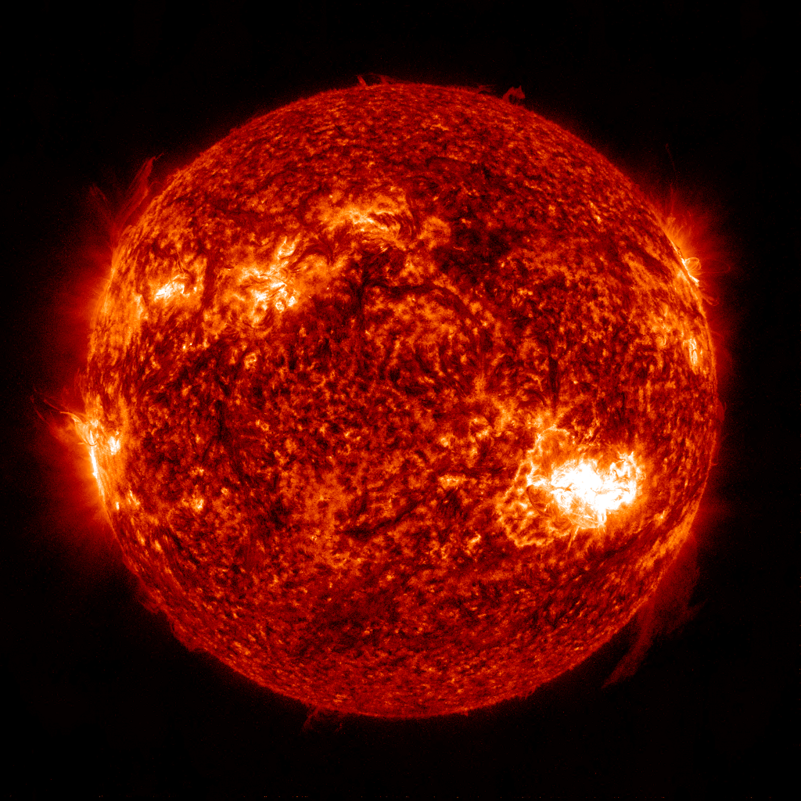

*Skills exercised: [`datasources/helioviewer.md`](../skills/datasources/helioviewer.md)*


### 3.26 `fetch_vso`

Science FITS from the VSO — the AR 12673 magnetogram used throughout the measure examples. Byte-stable: the hmipin validation case checksums this exact file.

```bash
uv run helio-agent run fetch_vso '{"start": "2017-09-06T11:00:00", "end": "2017-09-06T11:20:00", "instrument": "HMI", "max_files": 1, "physobs": "LOS_magnetic_field"}'
```
```text
n_found                      26
n_downloaded                 1
audit_id                     9c299d395754
```
*Skills exercised: [`datasources/vso.md`](../skills/datasources/vso.md), [`missions/sdo.md`](../skills/missions/sdo.md)*


### 3.27 `fetch_spacecraft_ephemeris`

L1 monitor trajectories from SSCWeb (GSE km).

```bash
uv run helio-agent run fetch_spacecraft_ephemeris '{"spacecraft": ["ace", "wind"], "start": "2017-09-01T00:00:00Z", "end": "2017-09-08T00:00:00Z"}'
```
```text
n_records                    841
columns                      ['ace_x_km', 'ace_y_km', 'ace_z_km', 'wind_x_km', 'wind_y_km', 'wind_z_km']
audit_id                     a6cc06ba5666
```
*Skills exercised: [`datasources/sscweb.md`](../skills/datasources/sscweb.md)*


### 3.28 `fetch_pyspedas`

The same ACE field through the mission's own pySPEDAS loader — the validation suite holds the two pipelines to 2% agreement.

```bash
uv run helio-agent run fetch_pyspedas '{"mission": "ace", "instrument": "mfi", "start": "2017-09-06", "end": "2017-09-08"}'
```
```text
n_records                    172800
columns                      ['Magnitude', 'BRTN_0', 'BRTN_1', 'BRTN_2', 'BGSEc_0', 'BGSEc_1', 'BGSEc_2', 'BGSM_0', 'BGSM_1', 'BGSM_2']
audit_id                     0015662b759a
```
*Skills exercised: [`tools/pyspedas_pytplot.md`](../skills/tools/pyspedas_pytplot.md)*


### 3.29 `fetch_swpc_timeseries`

Real-time L1 solar wind (last few days, operational grade).

```bash
uv run helio-agent run fetch_swpc_timeseries '{"product": "plasma"}'
```
```text
n_records                    2289
columns                      ['proton_density', 'proton_speed', 'proton_temperature']
audit_id                     8562bd15177c
```
*Skills exercised: [`datasources/noaa_swpc.md`](../skills/datasources/noaa_swpc.md)*


### 3.30 `fetch_kyoto_dst`

Kyoto WDC hourly Dst, pinned to the *final* revision — the revision is part of the citation.

```bash
uv run helio-agent run fetch_kyoto_dst '{"year": 2003, "month": 10, "revision": "final"}'
```
```text
n_records                    744
revision                     final
audit_id                     646d5c195795
```
*Skills exercised: [`methods/geomagnetic_storm_analysis.md`](../skills/methods/geomagnetic_storm_analysis.md)*


### 3.31 `fetch_gfz_index`

Definitive GFZ Kp for the Gannon storm (max 9.0).

```bash
uv run helio-agent run fetch_gfz_index '{"index": "Kp", "start": "2024-05-10", "end": "2024-05-12"}'
```
```text
n_records                    24
audit_id                     2fa53aaf19fb
```
*Skills exercised: [`methods/geomagnetic_storm_analysis.md`](../skills/methods/geomagnetic_storm_analysis.md)*


### 3.32 `fetch_solar_cycle`

NOAA solar-cycle progression: monthly and smoothed sunspot number.

```bash
uv run helio-agent run fetch_solar_cycle '{}'
```
```text
n_records                    213
audit_id                     b91fb0462d8d
```
*Skills exercised: [`methods/timing_periodicity.md`](../skills/methods/timing_periodicity.md)*


### 3.33 `save_json`

Persist any JSON-able intermediate so a later session can pick it up.

```bash
uv run helio-agent run save_json '{"name": "examples_note", "payload": {"purpose": "persist derived event lists between steps", "created_by": "gen_examples.py"}}'
```
```text
file                         <workspace>/data/examples_note.json
audit_id                     3b239b225388
```

## 4. reduce (10 tools)

Shape data without measuring anything: resample, merge, derive, transform, correct.


### 4.34 `describe_series`

First thing to run on any fetched CSV: coverage, gaps, fill fractions. A third of the Gannon plasma record is missing, and analyses must know that.

```bash
uv run helio-agent run describe_series '{"file": "<workspace>/data/OMNI_HRO_1MIN_2024-05-09_2024-05-15.csv"}'
```
```text
n_records                    8641
audit_id                     b27c962ef8b0
```
*Skills exercised: [`methods/troubleshooting.md`](../skills/methods/troubleshooting.md)*


### 4.35 `resample_series`

1-min to hourly. Averaging shallows extremes: the -518 nT SYM-H spike becomes -436 nT on this grid — quote which grid a minimum came from.

```bash
uv run helio-agent run resample_series '{"file": "<workspace>/data/OMNI_HRO_1MIN_2024-05-09_2024-05-15.csv", "cadence": "1h", "out_name": "examples_gannon_1h.csv"}'
```
```text
n_records                    145
audit_id                     00e217945ebb
```
*Skills exercised: [`methods/error_estimation.md`](../skills/methods/error_estimation.md)*


### 4.36 `compute_derived`

Derived column via pandas eval — dynamic pressure from n and V. No arbitrary code: numeric expressions over existing columns only.

```bash
uv run helio-agent run compute_derived '{"file": "<workspace>/data/examples_gannon_1h.csv", "expression": "1.6726e-6 * proton_density * flow_speed**2", "out_column": "pdyn_npa", "out_name": "examples_gannon_1h.csv"}'
```
```text
columns                      ['F', 'BY_GSM', 'BZ_GSM', 'flow_speed', 'proton_density', 'T', 'SYM_H', 'Pressure', 'pdyn_npa']
audit_id                     2e53b42dfbcb
```

### 4.37 `interpolate_gaps`

Gap-aware interpolation: short gaps filled, long ones left NaN so data absence stays visible.

```bash
uv run helio-agent run interpolate_gaps '{"file": "<workspace>/data/examples_gannon_1h.csv", "max_gap": "3h", "out_name": "examples_gannon_interp.csv"}'
```
```text
interp_limit_points          3
audit_id                     002c4921cc31
```

### 4.38 `shift_time`

Fixed lag shift, e.g. L1 to magnetopause before driving a model with real-time wind.

```bash
uv run helio-agent run shift_time '{"file": "<workspace>/data/examples_gannon_1h.csv", "shift": "45min", "out_name": "examples_gannon_shifted.csv"}'
```
```text
file                         <workspace>/data/examples_gannon_shifted.csv
shift                        45min
audit_id                     e41ac3dbbe4a
```

### 4.39 `merge_series`

Outer join on the time index. Timezone-aware inputs are converted to naive UTC and every conversion is reported; duplicate column names refuse rather than silently suffixing.

```bash
uv run helio-agent run merge_series '{"files": ["<workspace>/data/examples_gannon_1h.csv", "<workspace>/data/examples_swmf_1h.csv"], "out_name": "examples_gannon_merged.csv"}'
```
```text
n_records                    145
tz_normalized                []
audit_id                     3ca7ee08b566
```

### 4.40 `transform_coordinates`

GSE to GSM for the ACE field — validated against an independent geopack implementation to 1e-4 nT.

```bash
uv run helio-agent run transform_coordinates '{"file": "<workspace>/data/ace_mfi_2017-09-06.csv", "columns": ["BGSEc_0", "BGSEc_1", "BGSEc_2"], "from_coords": "gse", "to_coords": "gsm", "out_name": "examples_ace_gsm.csv"}'
```
```text
n_records                    172768
audit_id                     209ef467ac63
```
*Skills exercised: [`methods/coordinate_systems.md`](../skills/methods/coordinate_systems.md)*


### 4.41 `load_solar_map`

Open a FITS as a sunpy Map and report its identity — instrument, time, scale, observer — without plotting anything.

```bash
uv run helio-agent run load_solar_map '{"fits_file": "<workspace>/data/vso/hmi.m_45s.2017.09.06_11_01_30_TAI.magnetogram.fits"}'
```
```text
instrument                   HMI FRONT2
date                         2017-09-06T11:00:34.500
audit_id                     0a0e8800e024
```
*Skills exercised: [`tools/sunpy.md`](../skills/tools/sunpy.md)*


### 4.42 `aia_degradation`

AIA sensitivity loss by 2020: 171 at ~0.74 of launch, 304 at ~0.06. Ignoring this turns instrument decay into fake solar variability.

```bash
uv run helio-agent run aia_degradation '{"date": "2020-06-01", "channels": [171, 304]}'
```
```text
date                         2020-06-01
meaning                      fraction of 2010 launch sensitivity remaining; corrected = observed / factor
source                       aiapy.calibrate.degradation (SSW calibration series)
audit_id                     f3911afbf37d
```
*Skills exercised: [`missions/sdo.md`](../skills/missions/sdo.md), [`tools/sunpy.md`](../skills/tools/sunpy.md)*


### 4.43 `correct_aia_map`

Apply that correction to an AIA 171 image, writing a corrected FITS. UV channels (1600/1700) have no degradation series and are refused.

```bash
uv run helio-agent run correct_aia_map '{"fits_file": "<workspace>/data/vso/aia.lev1.171A_2017_09_06T12_00_09.35Z.image_lev1.fits"}'
```
```text
file                         <workspace>/data/aia.lev1.171A_2017_09_06T12_00_09.3...
channel_angstrom             171
degradation_factor           0.7399
date                         2017-09-06T12:00:09.350
audit_id                     a44229c4bc23
```
*Skills exercised: [`missions/sdo.md`](../skills/missions/sdo.md)*


## 5. measure (23 tools)

Every quantitative claim in a report comes from one of these, and carries the audit id to prove it.


### 5.44 `find_extrema`

The Halloween 2003 Dst minimum — matches the published -383 nT.

```bash
uv run helio-agent run find_extrema '{"file": "<workspace>/data/OMNI2_H0_MRG1HR_2003-10-28_2003-11-02.csv", "column": "DST1800", "mode": "min"}'
```
```text
value                        -383
time                         2003-10-30 22:30:00
audit_id                     dcea42823fb0
```
*Skills exercised: [`methods/geomagnetic_storm_analysis.md`](../skills/methods/geomagnetic_storm_analysis.md)*


### 5.45 `storm_metrics`

Minimum, classification, main-phase and recovery durations from a Dst series.

```bash
uv run helio-agent run storm_metrics '{"file": "<workspace>/data/OMNI2_H0_MRG1HR_2003-10-28_2003-11-02.csv", "dst_column": "DST1800"}'
```
```text
dst_min_nT                   -383
time_of_min                  2003-10-30 22:30:00
classification               extreme (G4-G5-like)
main_phase_hours             70
audit_id                     97a3fde90493
```
*Skills exercised: [`methods/geomagnetic_storm_analysis.md`](../skills/methods/geomagnetic_storm_analysis.md)*


### 5.46 `verify_claim`

Formal verdict on a published value vs an audit-logged computation. Refuses unit mismatches and unknown audit ids rather than comparing anyway.

```bash
uv run helio-agent run verify_claim '{"claimed_value": -383.0, "computed_value": -383.0, "claimed_units": "nT", "computed_units": "nT", "tolerance_percent": 2.0, "claim_description": "Halloween 2003 Dst minimum (Kyoto final)", "computed_audit_id": "dcea42823fb0"}'
```
```text
verdict                      match
audit_id                     4aab82d4abb3
```
*Skills exercised: [`methods/paper_reproduction.md`](../skills/methods/paper_reproduction.md)*


### 5.47 `find_flares`

SWPC-style flare detection on the XRS long channel: 2017-09-06 yields the X2.2 and the X9.3.

```bash
uv run helio-agent run find_flares '{"file": "<workspace>/data/GOES_XRS_2017-09-06_2017-09-07.csv"}'
```
```text
n_results                    38
audit_id                     01d8b8492029
```
*Skills exercised: [`methods/flare_analysis.md`](../skills/methods/flare_analysis.md)*


### 5.48 `flare_probability`

Per-region flare probability from the McIntosh class, evolution-aware. The three letters are read from three separate tables and never multiplied — `component_span` carries the honest spread.

```bash
uv run helio-agent run flare_probability '{"mcintosh_class": "Dkc", "previous_class": "Dai", "lon_deg": -20.0}'
```
```text
levels.C.probability         0.4934
levels.M.probability         0.1042
levels.C.components          {'zurich': 0.4934, 'penumbral': 0.8347, 'compactness': 0.9627}
assumed_no_evolution         False
audit_id                     2e6fe966431c
```
*Skills exercised: [`methods/flare_analysis.md`](../skills/methods/flare_analysis.md)*


### 5.49 `model_dst`

O'Brien & McPherron ring-current nowcast over the 2015 St Patrick's storm, scored against the observed index it was given.

```bash
uv run helio-agent run model_dst '{"file": "<workspace>/data/OMNI2_H0_MRG1HR_2015-03-15_2015-03-20.csv", "v_column": "V1800", "bz_column": "BZ_GSM1800", "density_column": "N1800", "dst_column": "DST1800", "out_name": "examples_modeldst.csv"}'
```
```text
model_min_nT                 -169.9
time_of_model_min            2015-03-18 00:30:00
skill                        {'corr': 0.966, 'rmse_nT': 22.4, 'obs_min_nT': -234.0, 'min_error_nT': 64.1}
audit_id                     22ea36833378
```
*Skills exercised: [`methods/geomagnetic_storm_analysis.md`](../skills/methods/geomagnetic_storm_analysis.md), [`methods/solar_wind_analysis.md`](../skills/methods/solar_wind_analysis.md)*


### 5.50 `cme_arrival`

Drag-based arrival for the 2012-07-12 CME: 1.9 h from the observed shock, inside the stated window.

```bash
uv run helio-agent run cme_arrival '{"v0_kms": 1400.0, "launch_time": "2012-07-12T19:35Z", "w_kms": 400.0}'
```
```text
arrival_estimate             2012-07-14 15:32:40.367633326+00:00
transit_hours                44
audit_id                     a75561fd3e92
```
*Skills exercised: [`methods/cme_analysis.md`](../skills/methods/cme_analysis.md)*


### 5.51 `propagation_delay`

Ballistic L1-to-magnetopause delay at a typical wind speed.

```bash
uv run helio-agent run propagation_delay '{"solar_wind_speed_kms": 450.0}'
```
```text
delay_minutes                55.6
audit_id                     da94a109dd81
```
*Skills exercised: [`methods/solar_wind_analysis.md`](../skills/methods/solar_wind_analysis.md)*


### 5.52 `detect_icme`

Shock, sheath and low-Tp ejecta for St Patrick's 2015 — boundaries within the hour of Richardson & Cane.

```bash
uv run helio-agent run detect_icme '{"file": "<workspace>/data/OMNI_HRO_1MIN_2015-03-16_2015-03-19.csv", "speed_column": "flow_speed", "temperature_column": "T", "by_column": "BY_GSM", "bz_column": "BZ_GSM", "density_column": "proton_density", "out_name": "examples_icme.png"}'
```
```text
shock_time                   2015-03-17 04:49:00
icme.start                   2015-03-17 13:38:00
icme.end                     2015-03-18 04:17:00
driver                       ejecta
audit_id                     ada96db3cc64
```

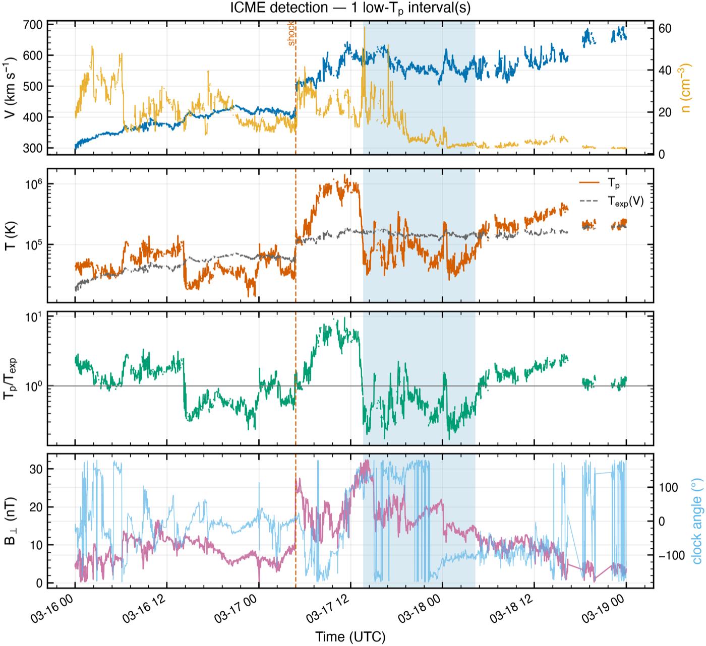

*Skills exercised: [`methods/solar_wind_analysis.md`](../skills/methods/solar_wind_analysis.md), [`methods/geomagnetic_storm_analysis.md`](../skills/methods/geomagnetic_storm_analysis.md)*


### 5.53 `characterize_sep`

The 2017-09-10 S3 radiation storm from measured GOES channels: peak 1493 pfu vs SWPC's published 1490, onset physics against the Parker spiral.

```bash
uv run helio-agent run characterize_sep '{"file": "<workspace>/data/GOES_protons_goes13_2017-09-09_2017-09-16.csv", "flux_10mev_column": "p_gt10", "flux_30mev_column": "p_gt30", "flare_peak_time": "2017-09-10T16:06:00Z", "flare_class": "X8.2", "flare_lon_deg": 88.0, "out_name": "examples_sep.png"}'
```
```text
sep.s_scale                  S3
sep.peak_10mev               {'value': 1493.48, 'time': '2017-09-11 11:45:00'}
sep.onset                    2017-09-10 16:45:00
physics.connection_angle_deg 33.4
audit_id                     5f12d14d1783
```

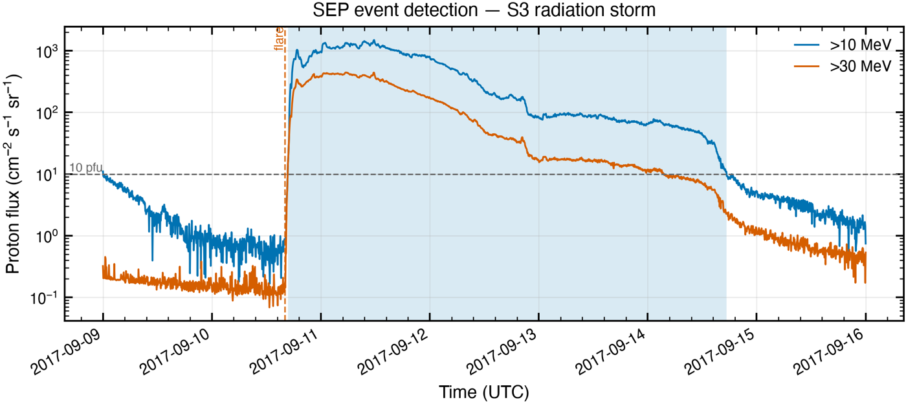

*Skills exercised: [`methods/sep_analysis.md`](../skills/methods/sep_analysis.md), [`datasources/goes_ncei.md`](../skills/datasources/goes_ncei.md)*


### 5.54 `radio_bursts`

Type III / type II classification on the WIND/WAVES spectrum; the X9.3's shock drives a 2160 km/s type II candidate.

```bash
uv run helio-agent run radio_bursts '{"file": "<workspace>/data/WI_K0_WAV_E_Average_2017-09-06_2017-09-06.csv", "out_name": "examples_radio.png"}'
```
```text
n_bursts                     6
counts                       {'type II candidate': 2, 'unclassified': 3, 'type III': 1}
audit_id                     3200f35a9160
```

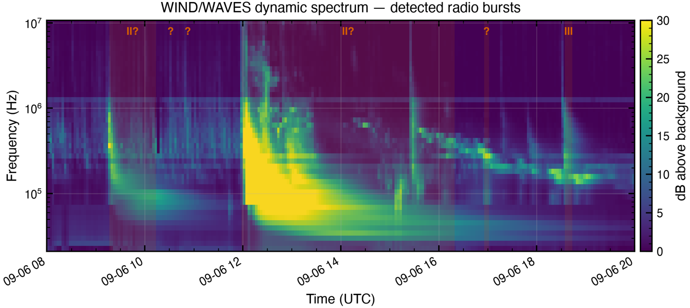

*Skills exercised: [`methods/radio_burst_analysis.md`](../skills/methods/radio_burst_analysis.md)*


### 5.55 `magnetogram_metrics`

Unsigned flux, peak field and the polarity-inversion-line proxy for AR 12673 — the delta-class signature, measured rather than eyeballed.

```bash
uv run helio-agent run magnetogram_metrics '{"fits_file": "<workspace>/data/vso/hmi.m_45s.2017.09.06_11_01_30_TAI.magnetogram.fits", "lat_deg": -9.0, "lon_deg": 33.0, "half_deg": 8.0, "out_name": "examples_magnetogram.png"}'
```
```text
region.unsigned_flux_mx      2.84288e+22
region.max_abs_b_g           2255.3
region.pil_length_mm         585.9
audit_id                     25268254dfc4
```

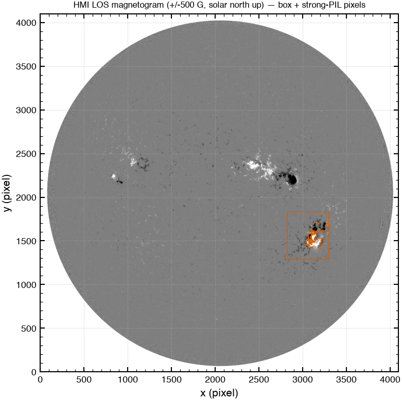

*Skills exercised: [`missions/sdo.md`](../skills/missions/sdo.md), [`methods/flare_analysis.md`](../skills/methods/flare_analysis.md)*


### 5.56 `cross_correlate`

Lagged correlation between observed and modelled Dst.

```bash
uv run helio-agent run cross_correlate '{"file": "<workspace>/data/examples_modeldst.csv", "column_a": "DST1800", "column_b": "dst_model", "max_lag": "12h"}'
```
```text
best_corr                    0.9665
best_lag                     0 days 01:00:00
audit_id                     bfd5cd2d0433
```
*Skills exercised: [`methods/timing_periodicity.md`](../skills/methods/timing_periodicity.md)*


### 5.57 `linear_fit`

Least-squares fit with parameter uncertainties.

```bash
uv run helio-agent run linear_fit '{"file": "<workspace>/data/examples_modeldst.csv", "x_column": "DST1800", "y_column": "dst_model"}'
```
```text
order                        1
rms_residual                 12.5401
n_points                     121
x_units                      DST1800
audit_id                     dd1f4fdd5f35
```
*Skills exercised: [`methods/error_estimation.md`](../skills/methods/error_estimation.md)*


### 5.58 `lomb_scargle`

Periodogram of a year of solar wind speed: the ~27-day synodic rotation and its 13.5-day harmonic.

```bash
uv run helio-agent run lomb_scargle '{"file": "<workspace>/data/OMNI2_H0_MRG1HR_2017-01-01_2017-12-31.csv", "column": "V1800", "min_period": "2D", "max_period": "60D"}'
```
```text
n_points                     8754
audit_id                     9d846c92f6c0
```
*Skills exercised: [`methods/timing_periodicity.md`](../skills/methods/timing_periodicity.md)*


### 5.59 `superposed_epoch`

SYM-H stacked around the Gannon storm's three published intensification steps (Hajra et al. 2024).

```bash
uv run helio-agent run superposed_epoch '{"file": "<workspace>/data/OMNI_HRO_1MIN_2024-05-09_2024-05-15.csv", "column": "SYM_H", "epochs": ["2024-05-10T19:21:00Z", "2024-05-10T23:12:00Z", "2024-05-11T02:14:00Z"], "before": "6h", "after": "12h", "cadence": "5min"}'
```
```text
n_epochs                     3
audit_id                     c802a3b57e52
```
*Skills exercised: [`methods/superposed_epoch.md`](../skills/methods/superposed_epoch.md)*


### 5.60 `extreme_value`

Peaks-over-threshold statistics on six decades of Dst: the 1989 storm's -589 nT and a ~-580 nT 100-year level.

```bash
uv run helio-agent run extreme_value '{"file": "<workspace>/data/OMNI2_H0_MRG1HR_1964-01-01_2024-12-31.csv", "column": "DST1800", "threshold": -100.0, "direction": "min"}'
```
```text
return_levels                {'1yr': -185.1, '10yr': -347.0, '50yr': -502.3, '100yr': -582.7}
audit_id                     b5bd503a7267
```
*Skills exercised: [`methods/error_estimation.md`](../skills/methods/error_estimation.md), [`methods/geomagnetic_storm_analysis.md`](../skills/methods/geomagnetic_storm_analysis.md)*


### 5.61 `extreme_value_sweep`

The same return level across threshold and declustering conventions — how sensitive is the answer to the analyst's choices?

```bash
uv run helio-agent run extreme_value_sweep '{"file": "<workspace>/data/OMNI2_H0_MRG1HR_1964-01-01_2024-12-31.csv", "column": "DST1800", "thresholds": [-80.0, -100.0, -120.0], "decluster_gaps_hours": [24.0, 48.0, 72.0], "direction": "min"}'
```
```text
return_period_years          100
n_valid                      9
audit_id                     5f3e377ab898
```
*Skills exercised: [`methods/error_estimation.md`](../skills/methods/error_estimation.md)*


### 5.62 `plasma_parameters`

Alfven speed, beta, gyroradius from PlasmaPy's formulary — checked against the analytic expressions in validation.

```bash
uv run helio-agent run plasma_parameters '{"density_cm3": 5.0, "b_nT": 5.0, "temperature_K": 100000.0}'
```
```text
alfven_speed_km_s            48.7599
plasma_beta                  0.69399
audit_id                     7e38acabeb26
```
*Skills exercised: [`tools/plasmapy.md`](../skills/tools/plasmapy.md), [`tools/pyhc_ecosystem.md`](../skills/tools/pyhc_ecosystem.md)*


### 5.63 `trace_field_line`

Tsyganenko T89 + IGRF trace from geosynchronous noon: closed line, auroral-zone footpoint.

```bash
uv run helio-agent run trace_field_line '{"x_gsm_re": 6.6, "y_gsm_re": 0.0, "z_gsm_re": 0.0, "time": "2017-09-06T12:00:00", "kp": 2}'
```
```text
topology                     closed
north_footpoint.geo_lat_deg  67.58
audit_id                     2ef45a59e42a
```
*Skills exercised: [`methods/coordinate_systems.md`](../skills/methods/coordinate_systems.md)*


### 5.64 `hindcast_forecasts`

The live monitor's forecast rule replayed over the Gannon month and scored against DONKI shocks and storms. This is the tool that set the 45-degree cone.

```bash
uv run helio-agent run hindcast_forecasts '{"start": "2024-05-01", "end": "2024-05-31", "out_name": "examples_hindcast.png", "table_name": "examples_hindcast.md"}'
```
```text
n_hits                       26
n_false_alarms               22
hit_rate                     0.542
storm_recall                 0.8
audit_id                     c6c7a60f3599
```

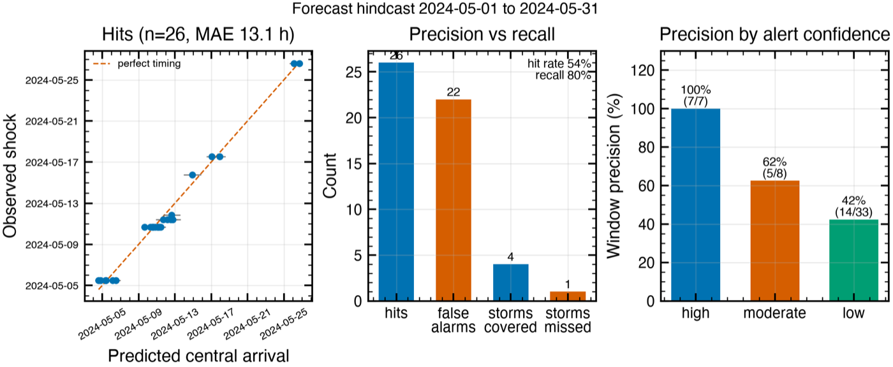

*Skills exercised: [`methods/cme_analysis.md`](../skills/methods/cme_analysis.md)*


### 5.65 `sta_20120723_summary`

A user-scoped one-off tool (users/cayoung): the 2012-07-23 STEREO-A event summary, encoding that event's shock-finding convention. One-off analyses live in profiles; core stays general.

```bash
uv run helio-agent run sta_20120723_summary '{"file": "<workspace>/data/STA_L2_MAGPLASMA_1M_2012-07-22_2012-07-27.csv"}'
```
```text
shock_time                   2012-07-23 20:55:58
r_au                         0.9641
audit_id                     f8f512c062d1
```
*Skills exercised: [`methods/cross_spacecraft.md`](../skills/methods/cross_spacecraft.md)*


### 5.66 `validate_reproduction_manifest`

Validates the manifest schema AND that every referenced audit id exists with matching recorded values.

```bash
uv run helio-agent run validate_reproduction_manifest '{"file": "<workspace>/data/examples_manifest.json"}'
```
```text
valid                        True
n_claims                     1
audit_id                     7768844d8478
```

## 6. report (11 tools)

Publication-styled figures and documents. The plotting conventions (UTC axes, CVD-safe palette, labelled units) come from one shared style module.


### 6.67 `plot_timeseries`

Publication-styled single-panel comparison; event markers as dashed verticals.

```bash
uv run helio-agent run plot_timeseries '{"file": "<workspace>/data/examples_modeldst.csv", "columns": ["DST1800", "dst_model"], "series_labels": ["Observed Dst (OMNI hourly)", "O'Brien & McPherron model"], "y_label": "Dst (nT)", "title": "St Patrick's Day 2015 \u2014 observed vs modelled ring current", "event_times": ["2015-03-17T04:45:00"], "event_labels": ["shock"], "out_name": "examples_timeseries.png"}'
```
```text
file                         <workspace>/outputs/examples_timeseries.png
audit_id                     785aacfbf559
```

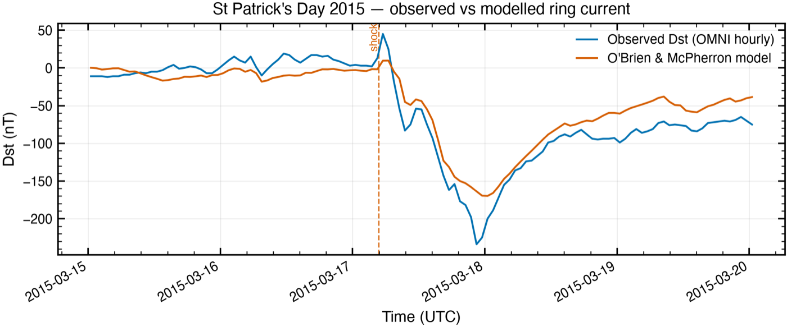

*Skills exercised: [`tools/plotting_conventions.md`](../skills/tools/plotting_conventions.md)*


### 6.68 `plot_stack`

The standard space-physics figure: stacked panels on a shared time axis, shock arrival and SYM-H minimum marked.

```bash
uv run helio-agent run plot_stack '{"files_columns": [{"file": "<workspace>/data/OMNI_HRO_1MIN_2024-05-09_2024-05-15.csv", "column": "F", "label": "|B| (nT)"}, {"file": "<workspace>/data/OMNI_HRO_1MIN_2024-05-09_2024-05-15.csv", "column": "BZ_GSM", "label": "Bz GSM (nT)"}, {"file": "<workspace>/data/OMNI_HRO_1MIN_2024-05-09_2024-05-15.csv", "column": "flow_speed", "label": "V (km s$^{-1}$)"}, {"file": "<workspace>/data/OMNI_HRO_1MIN_2024-05-09_2024-05-15.csv", "column": "proton_density", "label": "n (cm$^{-3}$)", "log": true}, {"file": "<workspace>/data/OMNI_HRO_1MIN_2024-05-09_2024-05-15.csv", "column": "SYM_H", "label": "SYM-H (nT)"}], "title": "Gannon superstorm, 2024 May \u2014 OMNI 1-min", "event_times": ["2024-05-10T17:05:00", "2024-05-11T02:14:00"], "out_name": "examples_stack.png"}'
```
```text
file                         <workspace>/outputs/examples_stack.png
n_panels                     5
audit_id                     b29046470373
```

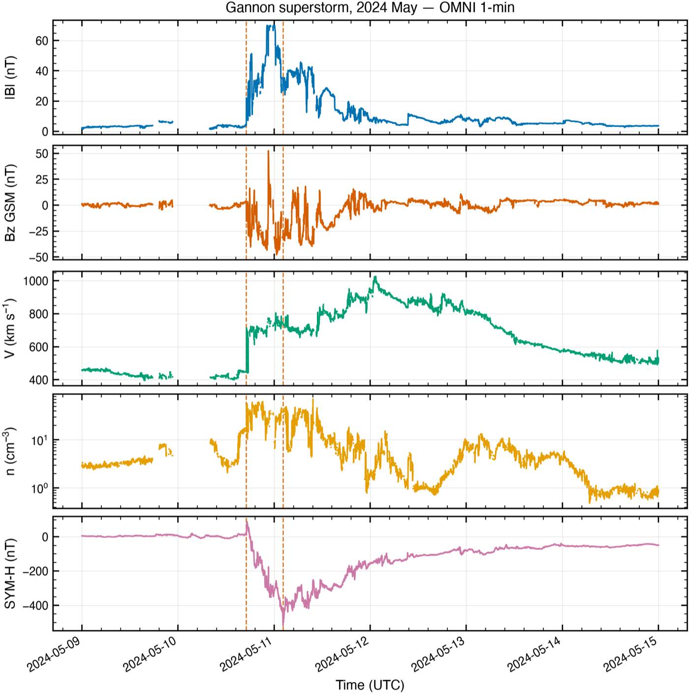

*Skills exercised: [`tools/plotting_conventions.md`](../skills/tools/plotting_conventions.md), [`methods/solar_wind_analysis.md`](../skills/methods/solar_wind_analysis.md)*


### 6.69 `plot_scatter`

Two-column scatter from the derived-pressure file.

```bash
uv run helio-agent run plot_scatter '{"file": "<workspace>/data/examples_gannon_1h.csv", "x_column": "flow_speed", "y_column": "pdyn_npa", "fit": false, "log_y": true, "x_label": "V (km/s)", "y_label": "Pdyn (nPa)", "title": "Gannon storm \u2014 dynamic pressure vs speed (hourly)", "out_name": "examples_scatter.png"}'
```
```text
file                         <workspace>/outputs/examples_scatter.png
n_points                     135
pearson_r                    0.3412
audit_id                     9e659e24929c
```

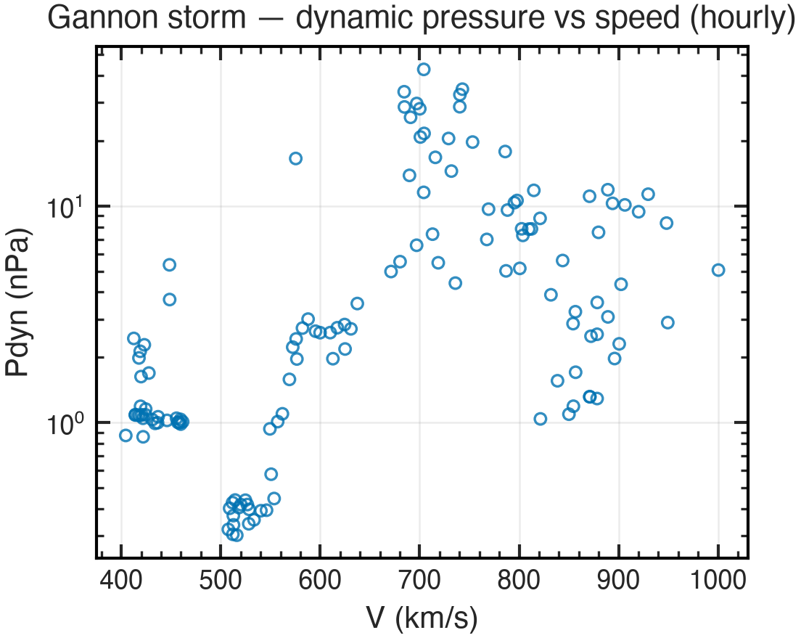


### 6.70 `plot_distribution`

Distribution view of a column — the -47.9 nT southward tail is the storm.

```bash
uv run helio-agent run plot_distribution '{"file": "<workspace>/data/OMNI_HRO_1MIN_2024-05-09_2024-05-15.csv", "columns": ["BZ_GSM"], "kind": "hist", "y_label": "Bz GSM (nT)", "title": "Bz distribution through the Gannon storm", "out_name": "examples_dist.png"}'
```
```text
file                         <workspace>/outputs/examples_dist.png
kind                         hist
n_points                     7557
audit_id                     35296342144a
```

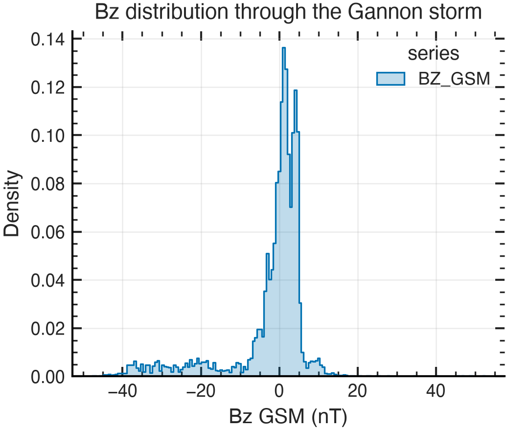


### 6.71 `plot_solar_map`

Any solar FITS with its proper colormap — the AR 12673 magnetogram.

```bash
uv run helio-agent run plot_solar_map '{"fits_file": "<workspace>/data/vso/hmi.m_45s.2017.09.06_11_01_30_TAI.magnetogram.fits", "out_name": "examples_solarmap.png"}'
```
```text
file                         <workspace>/outputs/examples_solarmap.png
instrument                   HMI FRONT2
date                         2017-09-06T11:00:34.500
audit_id                     6fbe8ba8d494
```

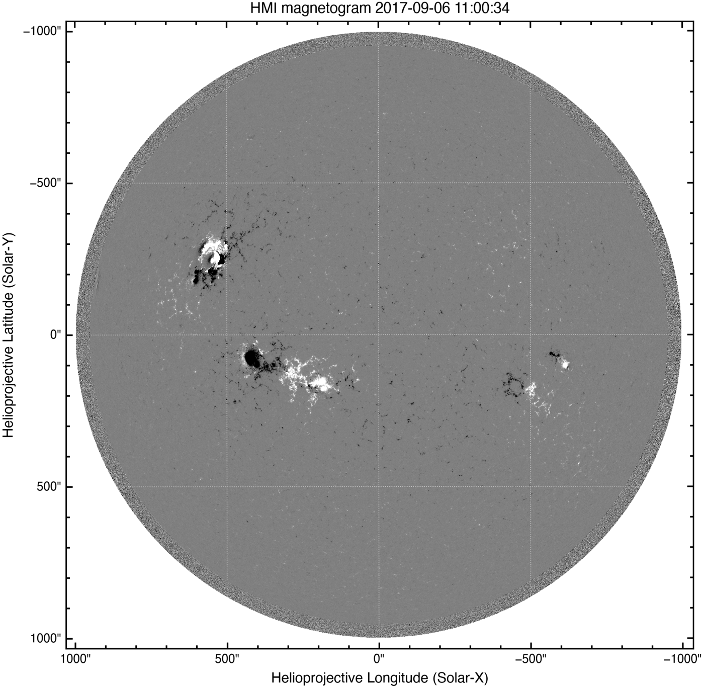

*Skills exercised: [`tools/sunpy.md`](../skills/tools/sunpy.md)*


### 6.72 `plot_solar_regions`

NOAA regions projected through the map's own WCS (B0 and P handled). Positions here are raw station measurements at their own observation time, two minutes from the image — no rotation correction to get wrong. The matching epoch matters: SWPC's daily `location` is valid at 2400 UT and sits ~14.5 deg west of these.

```bash
uv run helio-agent run plot_solar_regions '{"fits_file": "<workspace>/data/vso/AIA20260904_062700_1600.fits", "regions": [{"region": 4521, "location": "N09E23", "spot_class": "Hsx", "mag_class": "A"}, {"region": 4523, "location": "N10E31", "spot_class": "Hsx", "mag_class": "A"}, {"region": 4524, "location": "N12E64", "spot_class": "Cso", "mag_class": "B"}], "region_time": "2026-09-04T06:25:00Z", "label": "class", "out_name": "examples_regions.png"}'
```
```text
n_annotated                  3
age_hours                    0.0339231
audit_id                     5094d33f715b
```

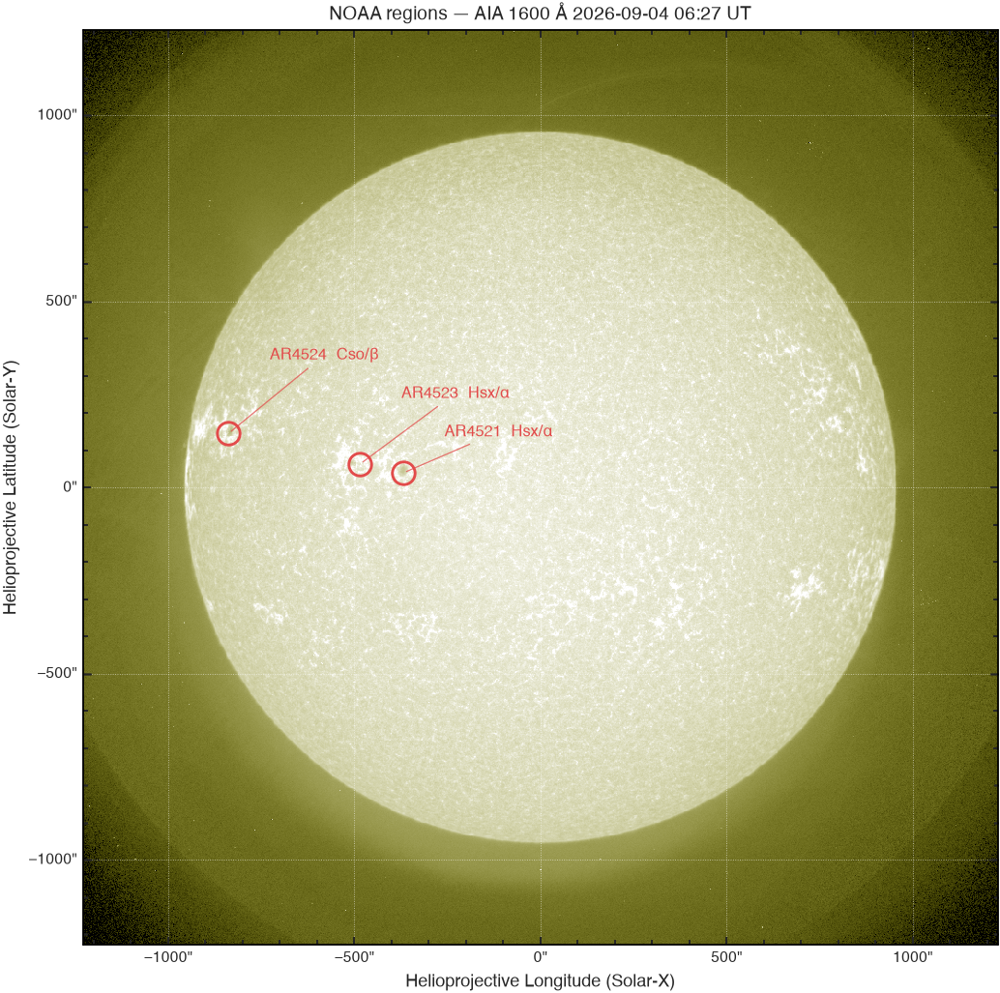

*Skills exercised: [`missions/sdo.md`](../skills/missions/sdo.md), [`datasources/noaa_swpc.md`](../skills/datasources/noaa_swpc.md)*


### 6.73 `plot_orbits`

Trajectories from the ephemeris CSV; Earth at origin.

```bash
uv run helio-agent run plot_orbits '{"file": "<workspace>/data/ephemeris_ace-wind_2017-09-01.csv", "plane": "xy", "units": "Re", "title": "ACE and Wind, 2017-09-01 to 08 (GSE)", "out_name": "examples_orbits.png"}'
```
```text
file                         <workspace>/outputs/examples_orbits.png
audit_id                     d52aaf4df950
```

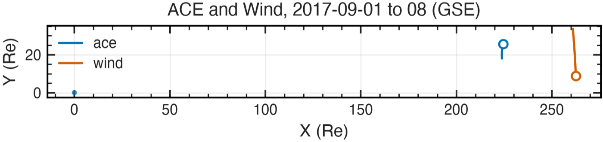

*Skills exercised: [`datasources/sscweb.md`](../skills/datasources/sscweb.md)*


### 6.74 `write_pdf_report`

Assemble figures and prose into a PDF. This example binds two figures generated above into one page.

```bash
uv run helio-agent run write_pdf_report '{"title": "Example: two storms, one page", "sections": [{"heading": "May 2024 solar wind", "text": "OMNI 1-min through the Gannon storm: field, Bz, speed, density and SYM-H, shock and minimum marked.", "image": "docs/examples/gannon_stack.png"}, {"heading": "September 2017 radiation storm", "text": "GOES >10 and >30 MeV integral proton flux around the X8.2 event, S-scale threshold and event span shaded.", "image": "docs/examples/sep_20170910.png"}], "out_name": "examples_report.pdf"}'
```
```text
file                         <workspace>/outputs/examples_report.pdf
n_sections                   2
audit_id                     450f48d6f864
```


### 6.75 `create_reproduction_manifest`

A deterministic, versioned record of a reproduced claim: what the paper said, what was computed, by which audited calls. The real worked example is the 2012-07-23 extreme CME under users/cayoung/analyses/.

```bash
uv run helio-agent run create_reproduction_manifest '{"paper": {"title": "Worked example (deterministic)", "doi": "10.0000/example"}, "claims": [{"id": "c1", "statement": "The ballistic L1 propagation delay at 500 km/s is reproduced.", "capability": "ready", "claimed": {"value": 50.0, "units": "minutes"}, "data": {"dataset": "constant-speed example", "instrument": "none", "processing_level": "derived", "cadence": "not applicable", "revision": "1", "time_window": "instantaneous"}, "recipe": [{"tool": "propagation_delay", "args": {"solar_wind_speed_kms": 500.0}, "audit_id": "25461eaa0ed1"}], "computed": {"value": 50.0, "units": "minutes", "tolerance_percent": 1.0, "verdict": "match", "verification_audit_id": "6b04e85bcb7e"}, "caveats": ["Deterministic input, chosen so the manifest chain can be demonstrated without archive access."]}], "out_name": "examples_manifest.json"}'
```
```text
file                         <workspace>/data/examples_manifest.json
n_claims                     1
audit_id                     db1ecf0ff5a8
```

### 6.76 `render_reproduction_report`

Deterministic Markdown from the validated manifest — same input, same bytes.

```bash
uv run helio-agent run render_reproduction_report '{"file": "<workspace>/data/examples_manifest.json", "out_name": "examples_reproduction.md"}'
```
```text
file                         <workspace>/outputs/examples_reproduction.md
audit_id                     a38158e9fae6
```


### 6.77 `export_html`

Self-hostable HTML from any workspace Markdown; offline, styles inlined, client-render runtimes SRI-pinned.

```bash
uv run helio-agent run export_html '{"markdown_file": "<workspace>/outputs/examples_reproduction.md", "out_name": "examples_export.html"}'
```
```text
bytes                        10304
audit_id                     97dab50438d0
```


## 7. Skills in practice

Skills are knowledge documents, not code — the contract requires reading the relevant ones before an analysis. This table shows where each one is exercised by the examples above; a skill with no example number is background craft that shapes how the others are used.


### Missions (14)

| Skill | What it teaches | Exercised by |
|---|---|---|
| [`missions/ace.md`](../skills/missions/ace.md) | One-line: NASA solar wind and energetic-particle monitor at L1 since 1997 — the long-baseline workhorse for upstream field, plasma, and composition. | — |
| [`missions/dscovr.md`](../skills/missions/dscovr.md) | One-line: NOAA's operational real-time solar wind monitor at L1 (launched 2015), the source of the live upstream data behind SWPC forecasts. | — |
| [`missions/goes.md`](../skills/missions/goes.md) | One-line: NOAA's geostationary fleet whose XRS soft X-ray fluxes define flare classes (C/M/X), plus energetic particle, magnetometer, and (GOES-R era) EUV imaging. | — |
| [`missions/hinode_iris.md`](../skills/missions/hinode_iris.md) | One-line: two Sun-pointing spectroscopy/high-resolution imaging observatories in sun-synchronous LEO — Hinode (JAXA/NASA/ESA, 2006-) for photospheric magnetism, X-ray corona, and EUV spectroscopy; IRIS (NASA SMEX, 2013-) for the chromosphere-transition-region interface. | — |
| [`missions/imap.md`](../skills/missions/imap.md) | One-line: NASA's newest L1 mission (launched 2025-09-24) mapping the heliosphere's boundary via energetic neutral atoms while serving as a next-generation real-time solar wind monitor. | — |
| [`missions/mms.md`](../skills/missions/mms.md) | One-line: four identical NASA spacecraft flying in a tight tetrahedron through Earth's magnetopause and magnetotail, resolving magnetic reconnection at electron scales. | — |
| [`missions/omni.md`](../skills/missions/omni.md) | One-line: not a spacecraft — NASA/SPDF's multi-source compilation of near-Earth solar wind field/plasma data, time-shifted to the bow shock nose, plus geomagnetic and solar indices. | — |
| [`missions/parker_solar_probe.md`](../skills/missions/parker_solar_probe.md) | One-line: NASA probe diving repeatedly into the solar corona (perihelia now inside 10 solar radii), measuring nascent solar wind fields, particles, and white-light structure in situ. | — |
| [`missions/sdo.md`](../skills/missions/sdo.md) | One-line: NASA's flagship solar imager in geosynchronous orbit, staring at the full solar disk continuously in EUV/UV/visible plus magnetograms. | 3.26, 4.42, 4.43, 5.55, 6.72 |
| [`missions/soho.md`](../skills/missions/soho.md) | One-line: ESA/NASA workhorse at L1 since 1996; today primarily valued for LASCO coronagraph CME imaging. | — |
| [`missions/solar_orbiter.md`](../skills/missions/solar_orbiter.md) | One-line: ESA/NASA encounter mission in an elliptical heliocentric orbit (perihelia ~0.28-0.5 AU, inclination rising over time), combining remote sensing and in-situ instruments off the Sun-Earth line. | — |
| [`missions/stereo.md`](../skills/missions/stereo.md) | One-line: twin NASA spacecraft in Earth-leading (Ahead) and Earth-trailing (Behind) heliocentric orbits, giving off-Sun-Earth-line imaging of CMEs and in-situ solar wind at ~1 AU. | — |
| [`missions/themis.md`](../skills/missions/themis.md) | One-line: five NASA probes launched to time substorm onset in Earth's magnetotail; three (THEMIS A/D/E) still orbit Earth, two (ARTEMIS P1/P2, formerly B/C) moved to lunar orbit in 2011. | — |
| [`missions/wind.md`](../skills/missions/wind.md) | One-line: NASA solar wind spacecraft, at L1 since 2004 (complex orbits before that), with arguably the best-calibrated long-baseline plasma and field measurements at 1 AU. | — |

### Data sources (12)

| Skill | What it teaches | Exercised by |
|---|---|---|
| [`datasources/cdaweb.md`](../skills/datasources/cdaweb.md) | NASA's Coordinated Data Analysis Web — the workhorse archive for heliophysics in-situ time series. | 1.4, 1.5, 3.19 |
| [`datasources/donki.md`](../skills/datasources/donki.md) | NASA CCMC's Space Weather Database Of Notifications, Knowledge, Information — human-curated space weather event catalog with linkages. | 1.6 |
| [`datasources/goes_ncei.md`](../skills/datasources/goes_ncei.md) | The science-quality GOES proton record, in two incompatible halves: measured integral channels through 2020-03-04, and a differential-only GOES-R archive after it. | 3.22, 5.53 |
| [`datasources/hapi.md`](../skills/datasources/hapi.md) | A standard REST interface for time-series data adopted by many heliophysics servers — one client, many archives. | 1.13, 3.23, 3.24 |
| [`datasources/hek.md`](../skills/datasources/hek.md) | Searchable catalog of solar events and features (flares, CMEs, active regions, coronal holes...) hosted at LMSAL. | 1.7 |
| [`datasources/heliodata.md`](../skills/datasources/heliodata.md) | NASA's new unified heliophysics data discovery portal — search >7800 datasets across the division from one place. | 1.8 |
| [`datasources/helioviewer.md`](../skills/datasources/helioviewer.md) | Fast browse imagery of the Sun (JPEG2000) via a simple API — for context and visualization, never photometry. | 3.25 |
| [`datasources/noaa_swpc.md`](../skills/datasources/noaa_swpc.md) | Operational, real-time space weather feeds from the NOAA Space Weather Prediction Center — freshest data, operational-grade caveats. | 1.1, 1.2, 1.3, 3.29, 6.72 |
| [`datasources/omniweb.md`](../skills/datasources/omniweb.md) | Multi-source solar wind and geomagnetic-index dataset, time-shifted to Earth's bow-shock nose — the default for solar wind context at Earth. | 1.5, 3.18 |
| [`datasources/solar_orbiter_stereo_lowlatency.md`](../skills/datasources/solar_orbiter_stereo_lowlatency.md) | Quick-look data from off-Sun-Earth-line spacecraft — hours-fresh, NOT science quality. | — |
| [`datasources/sscweb.md`](../skills/datasources/sscweb.md) | Satellite Situation Center — ephemeris (positions) for ~200 heliophysics-relevant spacecraft, plus conjunction finding. | 1.10, 3.27, 6.73 |
| [`datasources/vso.md`](../skills/datasources/vso.md) | Federated search/download across solar data archives — the sunpy Fido route to SDO, SOHO, and ground-based solar data. | 1.9, 3.26 |

### Methods (13)

| Skill | What it teaches | Exercised by |
|---|---|---|
| [`methods/cme_analysis.md`](../skills/methods/cme_analysis.md) | Measure CME kinematics from coronagraph height-time data and estimate Earth arrival, with catalog cross-checks. | 5.50, 5.64 |
| [`methods/coordinate_systems.md`](../skills/methods/coordinate_systems.md) | Know which frame a quantity is in, which frame the physics wants, and where transforms bite. | 4.40, 5.63 |
| [`methods/cross_spacecraft.md`](../skills/methods/cross_spacecraft.md) | Relate observations of the same plasma or structure at two spacecraft: lag correlation, ballistic mapping, and their limits. | 5.65 |
| [`methods/error_estimation.md`](../skills/methods/error_estimation.md) | Decide what the real uncertainty is, propagate it honestly, and admit when error bars are fiction. | 4.35, 5.57, 5.60, 5.61 |
| [`methods/flare_analysis.md`](../skills/methods/flare_analysis.md) | Classify and time solar flares from GOES XRS soft X-ray flux, then cross-check against catalogs and imagery. | 1.3, 1.6, 3.21, 5.47, 5.48, 5.55 |
| [`methods/geomagnetic_storm_analysis.md`](../skills/methods/geomagnetic_storm_analysis.md) | Characterize storms with Dst/SYM-H and Kp, classify intensity, and attribute the interplanetary driver. | 3.30, 3.31, 5.44, 5.45, 5.49, 5.52, 5.60 |
| [`methods/paper_reproduction.md`](../skills/methods/paper_reproduction.md) | Reproduce a paper's numbers with the tool layer, refusing dishonest comparisons. | 2.14, 5.46 |
| [`methods/radio_burst_analysis.md`](../skills/methods/radio_burst_analysis.md) | Detect and classify type III electron-beam and type II shock bursts in WIND/WAVES dynamic spectra, convert their frequency drift to a source speed, and tie them to the flare and CME. | 3.20, 5.54 |
| [`methods/sep_analysis.md`](../skills/methods/sep_analysis.md) | Detect and grade radiation storms (NOAA S scale) in >10 MeV proton flux, measure fluence and hardness, and test the onset against flare timing and Parker-spiral connection. | 3.22, 5.53 |
| [`methods/solar_wind_analysis.md`](../skills/methods/solar_wind_analysis.md) | Read L1 plasma/field data, distinguish slow/fast wind, and recognize ICME, magnetic cloud, and shock signatures. | 5.49, 5.51, 5.52, 6.68 |
| [`methods/superposed_epoch.md`](../skills/methods/superposed_epoch.md) | Stack many events on a common time axis to extract the average behavior and its uncertainty. | 5.59 |
| [`methods/timing_periodicity.md`](../skills/methods/timing_periodicity.md) | Find and validate periodic signals in solar and solar-wind time series, including gappy data. | 3.32, 5.56, 5.58 |
| [`methods/troubleshooting.md`](../skills/methods/troubleshooting.md) | Failure signatures in heliophysics data work, and whether to retry, fix, or re-plan. | 4.34 |

### Software craft (7)

| Skill | What it teaches | Exercised by |
|---|---|---|
| [`tools/analysis_notes.md`](../skills/tools/analysis_notes.md) | The canonical structure for an analysis note and how to publish it as a formatted page (unmarkdown), with seven vetted templates. | — |
| [`tools/cdf_files.md`](../skills/tools/cdf_files.md) | Reading NASA Common Data Format files with cdflib, and the ISTP conventions that make them self-describing. | — |
| [`tools/hapiclient.md`](../skills/tools/hapiclient.md) | The reference Python client for HAPI time-series servers. | — |
| [`tools/plotting_conventions.md`](../skills/tools/plotting_conventions.md) | Make plots the field recognizes: UTC time axes, labeled datasets and units, event markers, stacked panels, standard colormaps. | 6.67, 6.68 |
| [`tools/pyhc_ecosystem.md`](../skills/tools/pyhc_ecosystem.md) | Which PyHC package answers which need; core-package docs federate at https://heliopython.org/pyhc-docs/. | 5.62 |
| [`tools/pyspedas_pytplot.md`](../skills/tools/pyspedas_pytplot.md) | Mission-aware load routines plus the tplot variable/plot ecosystem — the IDL SPEDAS workflow in Python. | 1.11, 1.12, 3.28 |
| [`tools/sunpy.md`](../skills/tools/sunpy.md) | The core Python library for solar data: unified search/fetch (Fido), images (Map), and time series (TimeSeries). | 4.41, 4.42, 6.71 |

## 8. Modules — the Python API

Longer pipelines can be driven from Python instead of the CLI; every call is still one audit entry. `docs/MODULES.md` documents each module in full — these are the entry points in action.


### `helio_agent.registry`

Every tool call goes through here; run_tool wraps the function with an audit entry.

```python
from helio_agent.registry import run_tool, list_tools, get_tool

r = run_tool("propagation_delay", solar_wind_speed_kms=450.0)
print(r["delay_minutes"], r["audit_id"])   # every call carries its audit id
print(len(list_tools()), "tools registered")
print(get_tool("fetch_omni").doc.splitlines()[0])
```

### `helio_agent.audit`

The append-only record every result traces back to.

```python
import json
from helio_agent.workspace import LOG_DIR

last = json.loads(open(LOG_DIR / "audit.jsonl").readlines()[-1])
print(last["audit_id"], last["tool"], last["status"])
```

### `helio_agent.http`

Content-addressed cache for direct HTTP GETs (library-managed transfers are NOT covered — see the input-pin validation cases).

```python
from helio_agent.http import cached_get

r = cached_get("https://services.swpc.noaa.gov/json/solar_regions.json",
               ttl_seconds=3600)
print(len(r.json()), "rows, served with HELIO_CACHE_MODE readwrite")
```

### `helio_agent.workspace`

Where everything lands. With HELIO_AGENT_USER set, data/outputs/logs resolve to users/<name>/workspace.

```python
from helio_agent.workspace import WORKSPACE, data_path, output_path, active_user

print(active_user(), WORKSPACE)
print(data_path("example.csv"))     # workspace/data/example.csv
print(output_path("example.png"))   # workspace/outputs/example.png
```

### `helio_agent.monitor`

One standing-watch cycle: import CMEs, forecast Earth-directed ones, grade matured windows. docs/MONITOR.md explains it in plain language.

```python
from helio_agent.monitor import cycle, EARTH_DIRECTED_MAX_LON

print(EARTH_DIRECTED_MAX_LON)       # 45.0 — see hindcast.recall_neutral
summary = cycle()                   # what `helio-agent monitor` runs
print(summary["ledger_score"])
```

### `helio_agent.reports`

The daily sun-news report builder behind `helio-agent report sun-news`.

```python
# CLI is the intended interface:
#   uv run helio-agent report sun-news --archive
# Builds markdown + HTML + PDF editions from audited tool calls.
```

### `helio_agent.reproduction`

Schema and rendering for reproduction manifests (see the create/validate/render chain above).

```python
from helio_agent.registry import run_tool

m = run_tool("validate_reproduction_manifest", file="papers/example.json")
print(m["valid"], m["n_audit_refs"])
```

### `helio_agent.style`

One matplotlib style for every figure: CVD-checked palette, UTC axes.

```python
from helio_agent.style import apply_style, PALETTE

apply_style()
print(PALETTE[:3])   # the first three series colours
```

### `helio_agent.cli`

The `helio-agent` entry point.

```python
# uv run helio-agent list
# uv run helio-agent describe detect_icme
# uv run helio-agent run fetch_omni '{"start":"...","end":"..."}'
# uv run helio-agent audit 5
# uv run helio-agent replay <audit-id>
# uv run helio-agent monitor
```

### `helio_agent.tools.*`

The six tool families themselves — every example in sections 1-6 exercises one of these modules.

