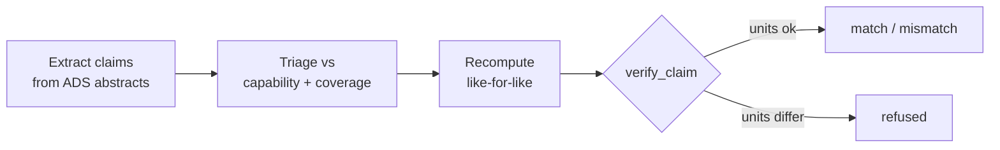

# Reproduction: the 2012 July 23 extreme CME at STEREO-A

**Published:** https://unmarkdown.com/u/calexyoung/repro-2012-07-23-extreme-cme (research template, unlisted)
**Analyst:** cayoung · **Date:** 2026-09-02 · **Method:** `skills/methods/paper_reproduction.md` · **Status:** complete

## Summary

The "Carrington-class" CME of 2012-07-23 reached STEREO-A (0.964 AU) in 18.3 hours. Three published claims reproduce exactly from archival Level-2 data; a fourth (impact speed 2246 km/s) is **blocked at L2** — the PLASTIC plasma instrument's standard processing could not handle the extreme flow, and the entire event interval is fill values.

## Papers

| Paper | Bibcode |
|---|---|
| Baker et al. 2013, Space Weather 11, 585 | 2013SpWea..11..585B |
| Russell et al. 2013, ApJ 770, 38 | 2013ApJ...770...38R |
| Cash et al. 2015, Space Weather 13, 611 | 2015SpWea..13..611C |
| Temmer et al. 2015, Solar Physics 290, 919 | 2015SoPh..290..919T |

## Verdicts

| Claim | Source | Computed | Verdict |
|---|---|---|---|
| STEREO-A at ~0.96 AU | Cash 2015 | 0.9641 AU | ✅ match (0.4%) |
| Arrival ~19 h after eruption | Baker 2013 | 18.3 h | ✅ match (3.6%) |
| Transit < 21 h | Cash 2015 | 18.3 h | ✅ satisfied |
| Peak B 109 nT | Russell 2013 | 109.086 nT | ✅ match (0.08%) |
| Impact speed 2246 km/s | Cash 2015 | — | ⛔ blocked at L2 |

> **The blocked claim is the finding.** A naive comparison against the post-gap L2 maximum (844 km/s) returns a 62% "mismatch" that would falsely indict the paper. The verifier's refuse-rather-than-false-mismatch rule is what kept this honest.

## Method

Key measurement: the interplanetary shock arrives as a |B| jump 9.6 → 24.9 nT at **2012-07-23 20:55 UT** — matching the published arrival to the minute.

## Data & provenance

- Dataset: `STA_L2_MAGPLASMA_1M`, 2012-07-22 → 07-27 (7,200 records)
- Audit ids: fetch `f1710fdc0d6c` · peak-B `e2987b4f79e9` · Vp extremum `72f676a00e01`
- Replay: `uv run helio-agent replay f1710fdc0d6c`

## Model cross-check

Drag-based model with DONKI inputs ($v_0 = 2500$ km/s at $21.5\,R_s$) and near-zero drag ($\gamma = 0.05 \times 10^{-7}$ km$^{-1}$) arrives in 17.7 h — within 0.6 h of observed. Default drag is far too slow: the July 19–21 precursor CMEs preconditioned the heliosphere (Temmer 2015), and the model only works when that physics is respected.

## Promotion notes

Nothing promoted to core (all capabilities existed). The event's immutable anchors became core validation case `repro20120723`, including a guard on the L2 plasma gap itself.
