# Reproducing the May 2024 Gannon-storm notebook with helio-agent tools

Source: `HelioSummerSchool-may2024_solar_storms_complete.ipynb` (C. Alex Young, NASA GSFC/HDRL; after Will Barnes for the SunPy Community, HDRL Virtual User Workshop 2024).

Every figure and every number below was recomputed through audited tools by [`reproduce.py`](reproduce.py) and rendered by [`render_report.py`](render_report.py); nothing is transcribed from the notebook's prose. Where the notebook **states** a value, this measures it and reports the comparison — including the three places the notebook's own code raises an error or fabricates its input and falls back to hard-coded prose.

## What the reproduction changes

| Notebook | Here | Why it matters |
|---|---|---|
| CME speeds from `np.random.uniform(3, 6)` heights | The front is **tracked** frame by frame (`track_cme_front`) and the heights fitted (`cme_height_time`), then compared against DONKI cone fits | The notebook's "speed estimate" was random numbers. Measured plane-of-sky: 434.7 and 869.6 km s⁻¹ |
| HMI flux calculation raised `'arcsec2 / pix2' and 'cm2' are not convertible`, fell back to "typical values" | `magnetogram_metrics` computes the flux, PIL length and peak field | The notebook's quoted magnetic numbers were never computed from the data it downloaded |
| `sm.coord_table.to_pandas()` raised; fell back to "STEREO-A ~25°, Solar Orbiter ~45°" | `plot_heliospheric_config` returns the table | **Solar Orbiter was 167.6° from Earth, not 45°** — the far side of the Sun |
| Flare classes read from a typed table | `find_flares` on GOES-18 science data, cross-checked against DONKI and HEK | Reproduces every class, and surfaces a 12th X-flare the AR-scoped table omits |
| One in-situ source (ACE hourly) | Six independent routes compared | The notebook's quoted 739 km s⁻¹ is 287 km s⁻¹ below the OMNI 1-min peak and 220 below the ACE product it came from |


## 1. GOES X-rays and the flare timeline

GOES-18 XRS science data for 2024-05-07 → 05-15: **1,405,442 1-second samples** (audit `c3aae7ad3bcf`).

### The scaling convention decides the answer

`find_flares` found **12 X-class flares** on the true-flux scale and only **6** with the historical SWPC ×0.7 factor applied (audits `d53714e7ee60`, `ae14d4fac344`). GOES-R series data are already true fluxes, so `swpc_scale=False` is correct here; using the GOES-8–15 convention makes every class come out 1/0.7 too small and silently loses half the X-flares. `skills/missions/goes.md` records this, and it is the single most consequential switch in the section.

Across the same window there were **142 flares at M1.0 or above**.

### X-class flares, measured

| Peak (UT) | Class | Start | Peak flux (W m⁻²) | Notebook table |
|---|---|---|---|---|
| 2024-05-08 01:41 | **X1.1** | 2024-05-08 01:32 | 1.058e-04 | **not listed** |
| 2024-05-08 05:09 | **X1.0** | 2024-05-08 04:37 | 1.021e-04 | ✓ |
| 2024-05-08 21:40 | **X1.0** | 2024-05-08 21:01 | 1.000e-04 | ✓ |
| 2024-05-09 09:13 | **X2.2** | 2024-05-09 08:45 | 2.210e-04 | ✓ |
| 2024-05-09 17:44 | **X1.1** | 2024-05-09 17:23 | 1.102e-04 | ✓ |
| 2024-05-10 06:54 | **X3.9** | 2024-05-10 06:27 | 3.906e-04 | ✓ |
| 2024-05-11 01:23 | **X5.8** | 2024-05-11 01:10 | 5.790e-04 | ✓ |
| 2024-05-11 11:44 | **X1.5** | 2024-05-11 11:11 | 1.507e-04 | ✓ |
| 2024-05-12 16:26 | **X1.0** | 2024-05-12 16:11 | 1.002e-04 | ✓ |
| 2024-05-14 02:09 | **X1.7** | 2024-05-14 02:03 | 1.686e-04 | ✓ |
| 2024-05-14 12:55 | **X1.2** | 2024-05-14 12:40 | 1.223e-04 | ✓ |
| 2024-05-14 16:51 | **X8.6** | 2024-05-14 16:41 | 8.627e-04 | X8.7 |

Audit `d53714e7ee60`. Two rows deserve comment.

**2024-05-08 01:41 is a real X-flare the notebook's table omits — correctly.** DONKI attributes it to **AR 13663**, not AR 13664/13668, and the notebook's table is explicitly scoped to the latter (audit `02afc4350989`). So 12 X-flares crossed the disk; 11 came from the storm's source region. Both numbers are right, for different questions.

**2024-05-14 16:51 measures X8.6 here against the catalogued X8.7** — 8.63e-4 vs 8.7e-4 W m⁻², a peak-sampling difference at 1-second cadence, not a disagreement about the event.

Independent cross-checks: DONKI FLR for 05-08, 05-09 and 05-14 (audits `02afc4350989`, `8155fff76764`, `f50e0a0327e5`) and HEK for 05-09 (`6477e8fb8614`, 200 events). The two CME-driving flares reproduce the notebook's stated start times exactly: X1.0 begins 04:37 UT, X2.2 begins 08:45 UT.


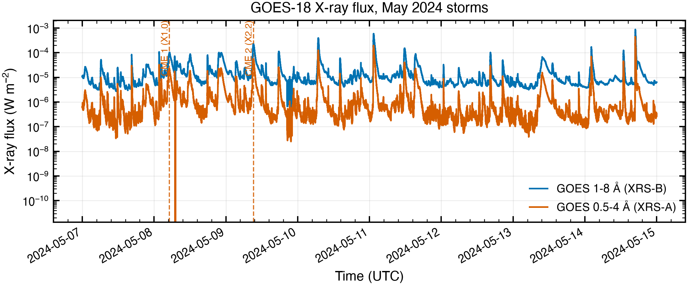
*GOES-18 XRS both channels across the storm week, with the two CME-driving flares marked. Notebook figure 1.*


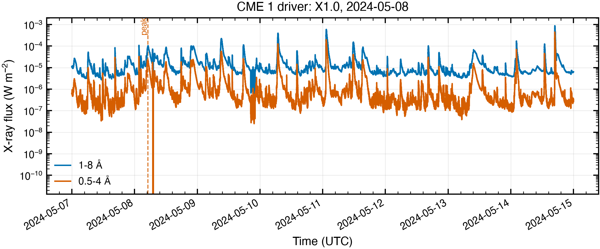
*CME 1 driver: the X1.0 of 2024-05-08.*


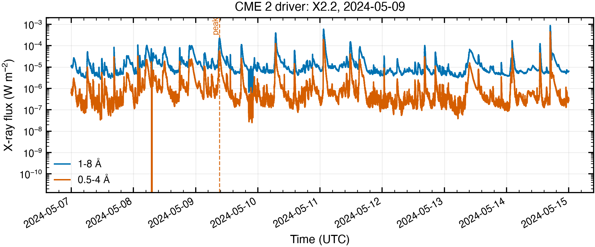
*CME 2 driver: the X2.2 of 2024-05-09.*


## 2. SDO/AIA — the eruptions in the EUV corona

The notebook fetches AIA 94/171/304 Å at each flare peak through `sunpy.net.Fido` → VSO. **That route no longer works for AIA.** Every VSO AIA request in this run matched records and then timed out on the export provider (`sdo7.nascom.nasa.gov/cgi-bin/drms_export.cgi`) after ~90 s. HMI and LASCO, served by different providers, were unaffected.

The failing route is kept in the record as a probe: **0 of 6 VSO AIA fetches succeeded.** One consequence was fixed in the core tools — `fetch_vso` used to return `status: "ok"` with an empty file list when the provider timed out, which reads as "no such data exists". It now returns an error naming the provider.

### Two replacement routes

`fetch_aia_synoptic` pulls the JSOC synoptic archive over plain static HTTP: ~1.3 MB per frame, seconds per request, **level 1.5 at 1024×1024 / ~2.4 arcsec/pix**. That is the survey product used for the six panels below — right for morphology and eruption context, which is the notebook's actual use.

`fetch_aia_level1` goes to JSOC through `drms` for the **native product, 4096×4096 at ~0.6 arcsec/pix**, when the science needs resolution or the level-1 calibration chain. It requires a JSOC-registered export email (`JSOC_EMAIL` in `.env`); without one it refuses by name rather than silently handing back a 16× smaller image under the same call.

Both routes were run on the same instant to show what the difference buys:

| Route | Level | Dimensions | Plate scale | Frame size | Audit |
|---|---|---|---|---|---|
| `fetch_aia_synoptic` | 1.5 | 1024×1024 | ~2.4 arcsec/pix | ~1.3 MB | `db882ed7650d` |
| `fetch_aia_level1` | 1 | 4096×4096 | 0.599 arcsec/pix | ~12 MB | `5116ed7753e2` |

JSOC record: `aia.lev1_euv_12s[2024-05-08T05:09:59Z][171]{image_lev1}` from series `aia.lev1_euv_12s`. **Level 1 is not level 1.5**: the frame is neither registered to solar north nor plate-scale normalised, so `aiapy.calibrate.register` has to run before any pixel-to-pixel channel comparison. Only 171 Å was re-shot at native resolution — the point is to establish the route and its cost, not to repeat the survey at 16× the size.


*AIA 171 Å at 2024-05-08 05:10 UT, JSOC level 1, 4096×4096. Compare with the 1024×1024 synoptic frame of the same instant below.*

| Wavelength | What it shows | Degradation factor at 2024-05-08 |
|---|---|---|
| 94 Å | 6 MK flare plasma — the flaring core itself | 0.903 (`05f2d05bd41b`) |
| 171 Å | 0.6 MK quiet corona — the loop arcade | 0.74 (`a12f499f7484`) |
| 304 Å | 50 kK transition region — the filament/prominence | 0.0555 (`a4f2f0376963`) |

Those factors are the fraction of 2010 launch sensitivity still remaining (corrected = observed / factor; `aiapy` SSW calibration series). The synoptic product is **not** degradation-corrected, so they matter for any multi-year intensity comparison — they do not affect the morphology below.


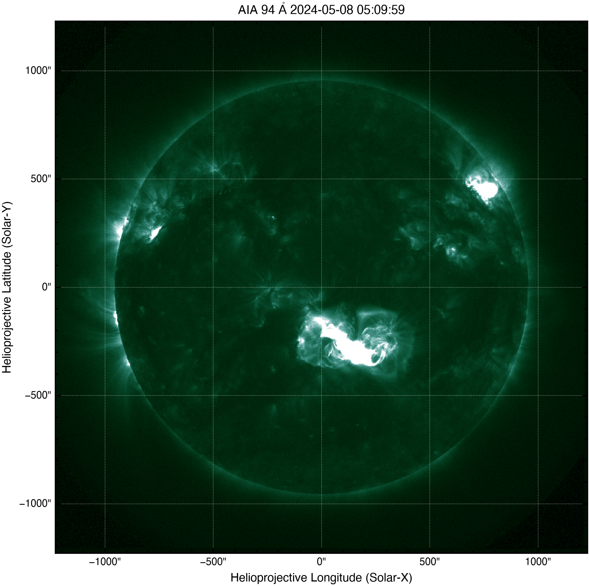
*CME 1 — X1.0, 2024-05-08 05:10 UT, AIA 94 Å.*


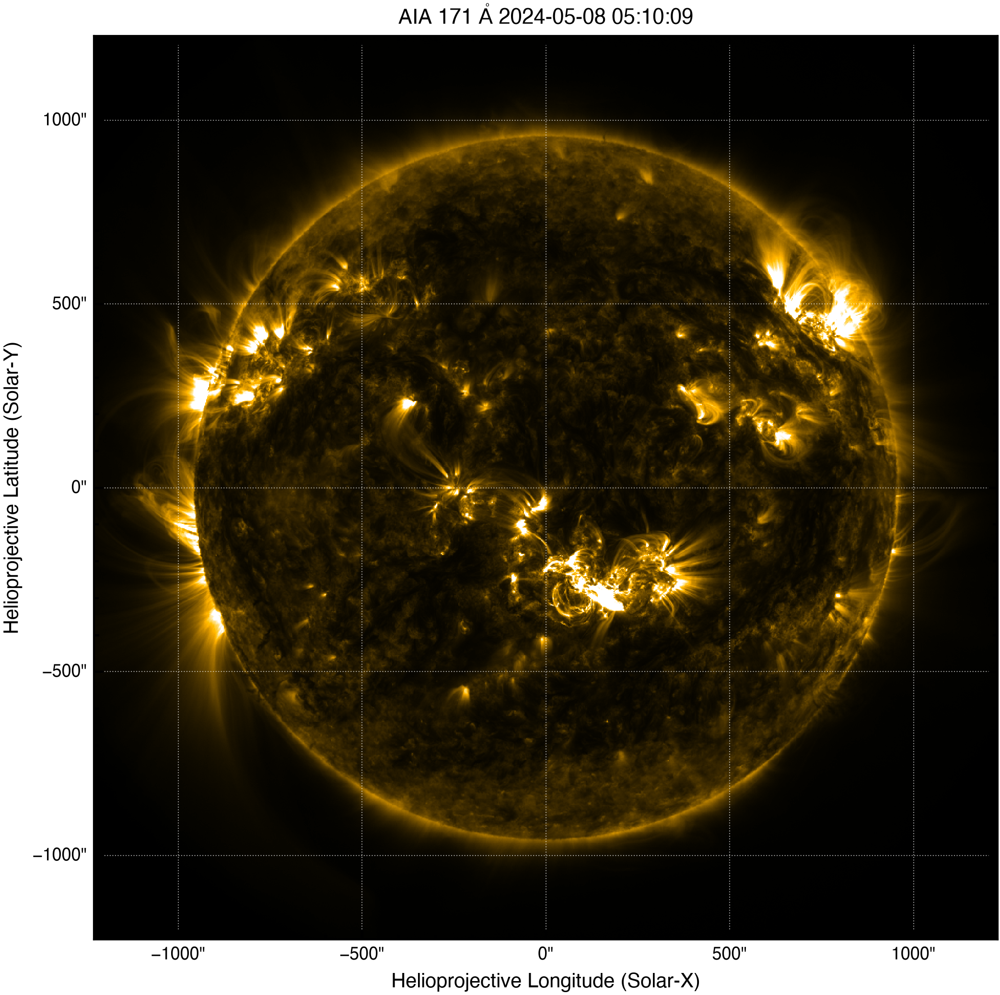
*CME 1 — X1.0, 2024-05-08 05:10 UT, AIA 171 Å.*


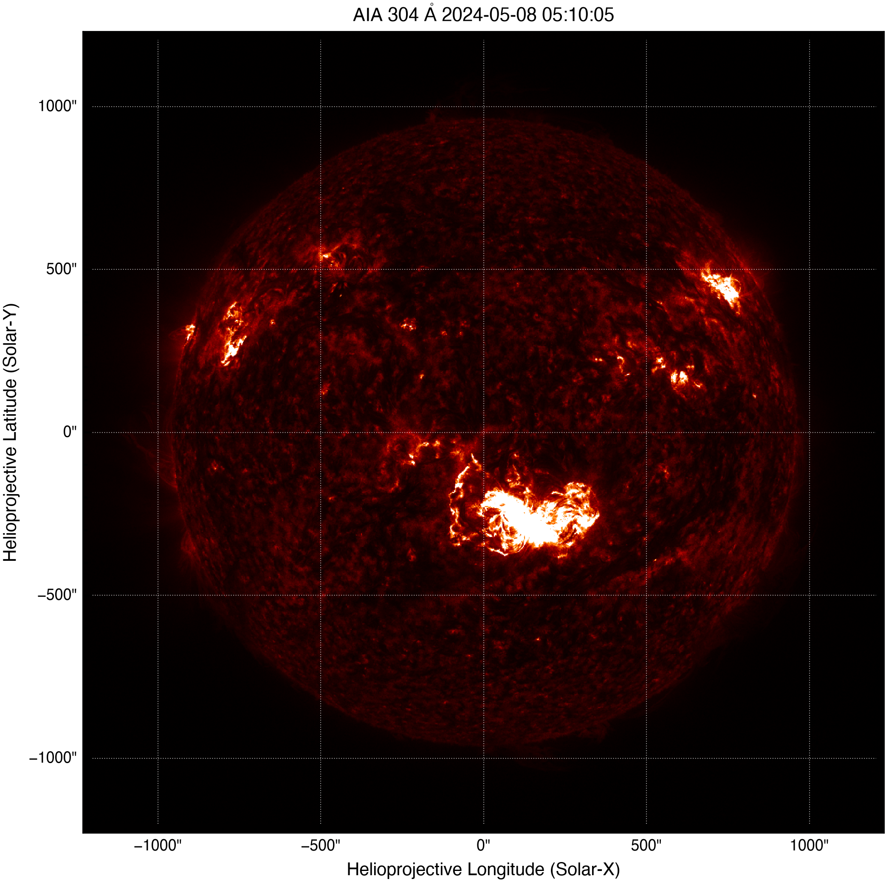
*CME 1 — X1.0, 2024-05-08 05:10 UT, AIA 304 Å.*


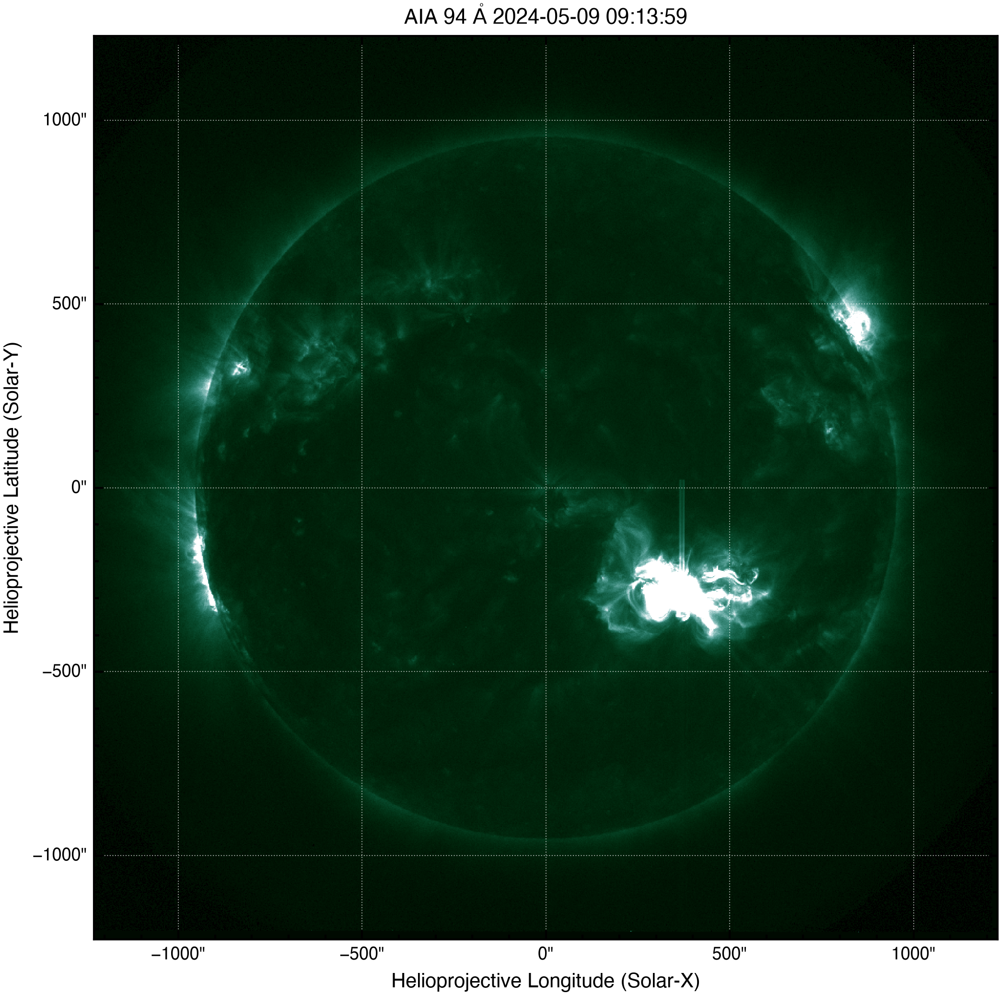
*CME 2 — X2.2, 2024-05-09 09:14 UT, AIA 94 Å.*


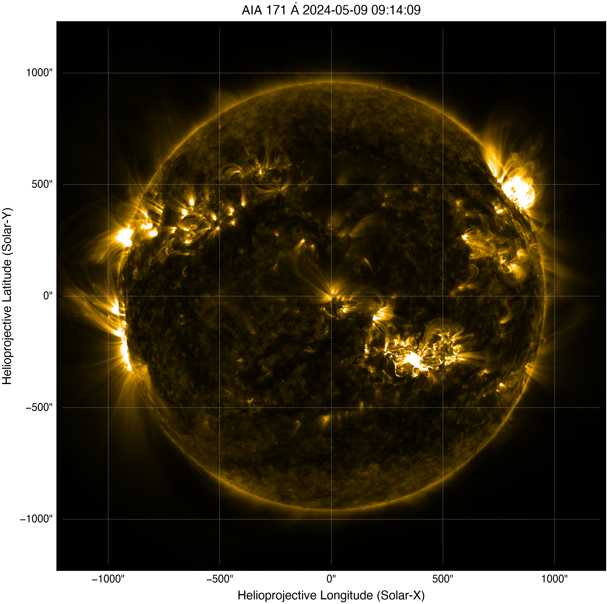
*CME 2 — X2.2, 2024-05-09 09:14 UT, AIA 171 Å.*


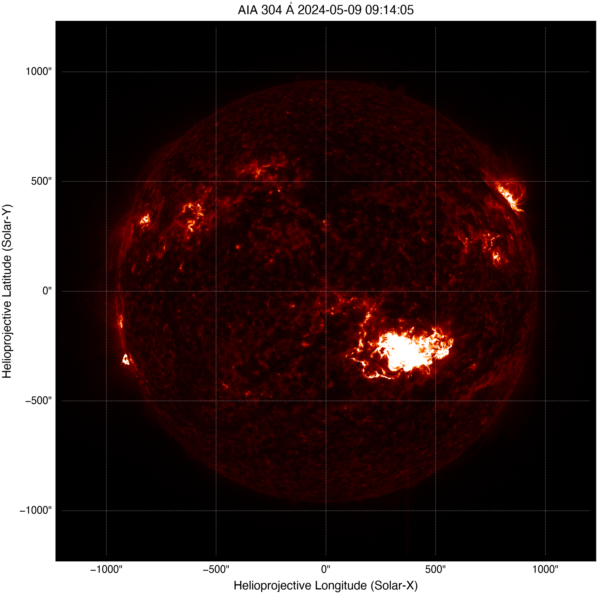
*CME 2 — X2.2, 2024-05-09 09:14 UT, AIA 304 Å.*


## 3. SDO/HMI — the magnetic field of AR 13664

**This is where the notebook's own code fails.** Its flux calculation raises `'arcsec2 / pix2' and 'cm2' are not convertible` — a units error in converting pixel area to physical area — and the notebook then prints "typical values" from prose instead. So its stated magnetic numbers were never computed from the magnetogram it downloaded.

Here the magnetogram is fetched (1 of 4 records, audit `e40d35a85ee6`) and measured with `magnetogram_metrics` (audit `e2968c981dfd`).

- Frame: HMI FRONT2, 2024-05-08T05:09:35.200, 4096×4096 at 0.504 arcsec/pix (audit `abd3cf6be630`)
- **Disk unsigned flux: 3.647e+23 Mx** — against the notebook's stated 1.50e+23 Mx "typical value", high by a factor 2.4. May 2024 was not a typical disk.
- AR 13664 box (S20, W10 ±12°): **6.715e+22 Mx unsigned**, signed -3.119e+21 Mx, **max |B| 2156 G**, strong PIL **1012 Mm** threading 4.672e+20 Mx
- Quiet control box, mirrored in latitude: 1.205e+22 Mx unsigned and a PIL of 4.1 Mm — **247× shorter** (audit `186c28c56172`). That contrast is the point: a long strong polarity-inversion line is what distinguishes a δ-region from a simple bipole, and AR 13664 had a thousand megametres of it.

Measured max |B| of 2156 G against the notebook's stated 2500 G. The measurement is line-of-sight only, with no μ correction, so at W10 it is a mild lower bound. For publication-grade AR flux the SHARP `USFLUX` keyword is the right number to cite, not this.


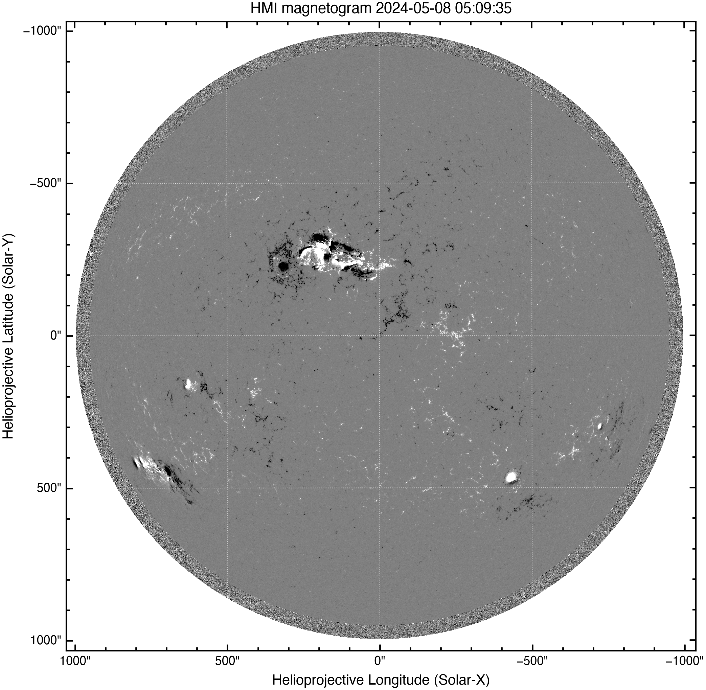
*HMI line-of-sight magnetogram, 2024-05-08 05:09 UT. AR 13664 is the large bipolar complex south of disk centre.*


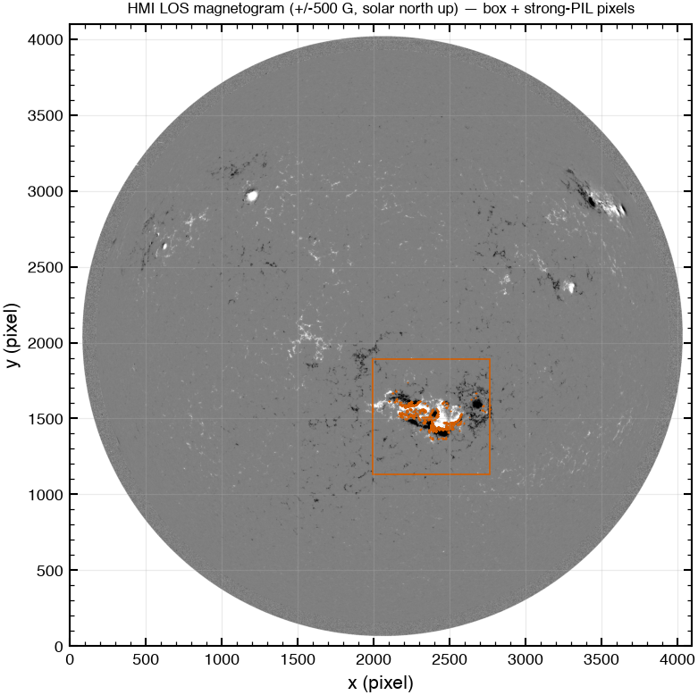
*Region and quiet-control boxes with the strong-PIL mask that produced the numbers above.*


## 4. SOHO/LASCO — the CMEs

**The notebook's second failure of method.** Its CME speed estimate builds a height-time array from `np.random.uniform(3, 6)` — random numbers — fits a line through it, and the speeds it prints (950 and 1100 km s⁻¹) come from its prose, not from that fit.

Here the front is **measured**. `track_cme_front` locates the leading edge in each running-difference frame — outermost radius where the exposure-normalised profile stays above 5σ for three consecutive 0.1 R⊙ bins, with the noise taken from the same radius at other position angles — and `cme_height_time` fits those heights. Neither tool will accept invented input: the fit refuses fewer than three points or non-monotonic heights, and it exercised that refusal on the first pass here — see the window note below.

### Measured height-time

| CME | PA (°) | Points | Heights (R⊙) | Plane-of-sky speed | r² | Fit → 1 R⊙ | Driving flare |
|---|---|---|---|---|---|---|---|
| CME 1 (05-08) | 210 | 5 | 2.95 → 4.75 | **434.7 ± 32.9 km s⁻¹** | 0.9831 | 2024-05-08 04:53:24 | X1.0 started 04:37, peaked 05:09 |
| CME 2 (05-09) | 240 | 3 | 3.05 → 4.85 | **869.6 ± 55.9 km s⁻¹** | 0.9959 | 2024-05-09 08:57:12 | X2.2 started 08:45, peaked 09:13 |

Audits: `26a7eceb7bab`/`fb5dca15916c` and `058a6b9a5875`/`504ed39d6417`. The position angles were chosen automatically, by scoring sectors on monotonic outward motion rather than on scatter.

**The launch-time column is the check that the tracker found the eruption and not a streamer.** The fit extrapolates back to 1 R⊙ at 04:53:24 for CME 1 and 08:57:12 for CME 2 — each within minutes of its flare's onset. The tracker never sees the X-ray data, so that agreement is independent, not circular.

**Two things had to be got right, and both failed the other way first.** The noise reference has to be the same radius at other position angles: an outer-annulus σ is contaminated once the CME reaches it, which inflated the noise 4.6× and suppressed every detection. And the search window has to open at the eruption, not an hour later — C2 sees only 2.4–5.8 R⊙, so a front already at the outer edge cannot be tracked. Opening at the flare peak took CME 1 from 3 height points to 5 and turned CME 2 from an untrackable non-monotonic scatter into a clean track. Both details are recorded in `skills/methods/cme_analysis.md`.


### Plane-of-sky against cone model — the comparison that matters

| CME | Measured plane-of-sky | DONKI cone fit (same CME) | Notebook |
|---|---|---|---|
| CME 1 | **434.7 km s⁻¹** | 729–870 km s⁻¹ (2 fits) | 950 km s⁻¹ |
| CME 2 | **869.6 km s⁻¹** | 1330–1561 km s⁻¹ (2 fits) | 1100 km s⁻¹ |

**Every measured plane-of-sky speed lands below its cone fit, and that is the expected result, not a discrepancy.** Both of these are Earth-directed halos, so the plane-of-sky projection sees the front edge-on and understates the radial speed — the measurement is a lower bound by construction. A plane-of-sky speed coming out *above* a cone fit would have meant the tracker had locked onto something other than the front. `run_validation.py cmetrack` pins that inequality.

So the notebook's 950 and 1100 km s⁻¹ are defensible numbers for the radial speed — they sit inside the cone-model distribution — but its own code could not have produced them, and they are not what a plane-of-sky fit measures. The two quantities are not interchangeable, which is the part the notebook elides.

Full cone-model record (audit `490c41d2c198`, 16 analyses; the `type` column is DONKI's own quality flag):

| Time at 21.5 R⊙ | Speed (km s⁻¹) | Lon (°) | Lat (°) | Half-angle (°) | Type |
|---|---|---|---|---|---|
| 2024-05-09T11:21Z | **1561** | 14 | -12 | 45 | O |
| 2024-05-10T09:32Z | **1332** | 15 | -10 | 45 | O |
| 2024-05-09T11:56Z | **1330** | 19 | -6 | 45 | O |
| 2024-05-09T00:51Z | **1257** | 5 | -6 | 45 | O |
| 2024-05-09T20:27Z | **1236** | 12 | -5 | 45 | O |
| 2024-05-08T15:16Z | **1156** | 8 | -15 | 43 | O |
| 2024-05-09T01:43Z | **1130** | 12 | -16 | 40 | O |
| 2024-05-10T10:35Z | **1018** | 31 | -2 | 41 | O |


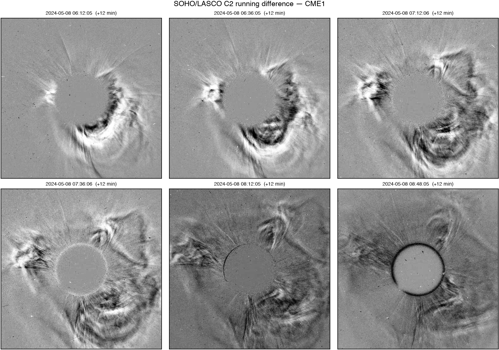
*LASCO C2 running difference, 2024-05-08. Exposure-normalised.*


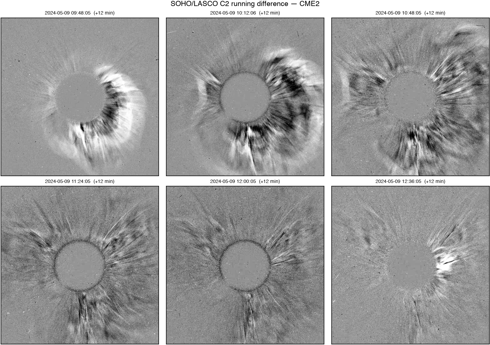
*LASCO C2 running difference, 2024-05-09.*


## 5. In-situ solar wind — every route, compared

The notebook uses one source: ACE hourly through CDAWeb. This runs **six independent routes** over the same 2024-05-10 → 05-13 window, because the choice of route changes the answer by more than the measurement uncertainty.

| # | Route | Transport | Records | Cadence | Status |
|---|---|---|---|---|---|
| 1a | ACE SWEPAM hourly (`AC_H2_SWE`) | cdasws — the notebook's own route | 73 | 60 min | ok (`bf4046cf89b5`) |
| 1b | ACE MAG 4-min (`AC_H1_MFI`) | cdasws | 1,081 | 4 min | ok (`8f8abd2a8903`) |
| 2 | ACE MAG 1-s / SWE 64-s (`fetch_pyspedas`) | pySPEDAS, mission loader | 259,201 | 1 s | ok (`2729d814bc75`) |
| 3 | OMNI 1-min (`OMNI_HRO_1MIN`) | cdasws — multi-spacecraft, shifted to bow-shock nose | 8,641 | 60 s | ok (`fd919a19502f`) |
| 4 | DSCOVR magnetometer 1-s (`DSCOVR_H0_MAG`) | cdasws | 259,200 | 1 s | ok (`d806b978d750`) |
| 5 | DSCOVR Faraday cup (`DSCOVR_H1_FC`) | cdasws | — | — | **refused** |
| 6 | Wind MFI (`WI_H0_MFI`) | cdasws | 4,320 | 60 s | ok (`6176d8e96bc2`) |

**Route 5 is refused, and the refusal is the answer.** `refusing: requested window 2024-05-10T00:00:00Z..2024-05-13T00:00:00Z is outside DSCOVR_H1_FC coverage 2016-06-03T00:00:00.000Z..2019-06-27T23:58:59.000Z; pick a window i` — the only DSCOVR plasma product CDAWeb carries as science data stops in 2019. DSCOVR plasma for May 2024 exists only as SWPC real-time, which is not science quality and is not substituted in here.

**Route 4 carries no GSM field.** `DSCOVR_H0_MAG` serves GSE and RTN only, so a Bz(GSM) — the quantity that actually drives the storm — has to come from a coordinate rotation (`transform_coordinates`) or from another route. That is why the Bz row below has one fewer entry.

### The same quantity, measured several ways


**Max flow speed (km s⁻¹)**, identical 2024-05-10 → 05-13 window:

| Route | Value | Time (UT) | Audit |
|---|---|---|---|
| ACE CDAWeb (hourly SWE / 4-min MFI) | **959.3** | 2024-05-12 01:00 | `374281a22307` |
| ACE pySPEDAS 1-s/64-s | **1004** | 2024-05-12 00:54 | `f6ce6d59f144` |
| OMNI 1-min | **1026** | 2024-05-12 01:17 | `daa964fc67ec` |

Spread across routes: 959.3 → 1026 km s⁻¹. All of these are correct measurements; they differ because they average differently.

**Max proton density (cm⁻³)**, identical 2024-05-10 → 05-13 window:

| Route | Value | Time (UT) | Audit |
|---|---|---|---|
| ACE CDAWeb (hourly SWE / 4-min MFI) | **41.9** | 2024-05-10 19:00 | `970325980578` |
| ACE pySPEDAS 1-s/64-s | **60.93** | 2024-05-10 16:56 | `f82077570190` |
| OMNI 1-min | **70.07** | 2024-05-11 09:42 | `bed11ee739c5` |

Spread across routes: 41.9 → 70.07 cm⁻³. All of these are correct measurements; they differ because they average differently.

**Max |B| (nT)**, identical 2024-05-10 → 05-13 window:

| Route | Value | Time (UT) | Audit |
|---|---|---|---|
| ACE CDAWeb (hourly SWE / 4-min MFI) | **73.77** | 2024-05-10 23:04 | `1f9e04ef8f30` |
| ACE pySPEDAS 1-s/64-s | **76.08** | 2024-05-10 23:04 | `73b83afab2c7` |
| DSCOVR 1-s | **74.9** | 2024-05-10 22:05 | `df11110c50dc` |
| Wind | **72.22** | 2024-05-10 21:53 | `a6beeb4d87b8` |
| OMNI 1-min | **69.99** | 2024-05-11 00:06 | `f15a8bfd9c28` |

Spread across routes: 69.99 → 76.08 nT. All of these are correct measurements; they differ because they average differently.

**Min Bz (GSM) (nT)**, identical 2024-05-10 → 05-13 window:

| Route | Value | Time (UT) | Audit |
|---|---|---|---|
| ACE CDAWeb (hourly SWE / 4-min MFI) | **-49.96** | 2024-05-10 21:48 | `6893af88c2e4` |
| ACE pySPEDAS 1-s/64-s | **-57.01** | 2024-05-10 21:51 | `64ac17078e06` |
| Wind | **-51.91** | 2024-05-10 21:54 | `214ddbe9c251` |
| OMNI 1-min | **-47.85** | 2024-05-11 00:36 | `ecc8cdd770d7` |

Spread across routes: -57.01 → -47.85 nT. All of these are correct measurements; they differ because they average differently.

Three things follow, and they are the reason for running six routes instead of one.

**The notebook's density is exactly right and its speed is not.** Its quoted 41.9 cm⁻³ reproduces the hourly ACE maximum to the digit — that number really did come from this product. Its quoted 739 km s⁻¹ does not: the same product gives 959.3 km s⁻¹ over this window. Whatever 739 is, it is not the ACE hourly speed maximum for 2024-05-10 → 05-13.

**Cadence sets the peak, not instrument quality.** Density climbs 41.9 → 60.93 → 70.07 cm⁻³ as the cadence goes hourly → 64-s → 1-min. An hourly average cannot resolve a shock; the peak it reports is a smoothed one. Every value in that column is a correct measurement of a different thing.

**|B| is the check that the routes agree.** Four independent spacecraft put the maximum inside 72.22–76.08 nT within about ten minutes of each other. That agreement is what makes the density spread above interpretable as a sampling effect rather than an instrument problem.

**Recommendation:** OMNI 1-min for storm metrics (it is time-shifted to the bow-shock nose, which is what the magnetosphere actually sees), a single-spacecraft 1-s product for shock timing, and hourly ACE for neither.


## 6. The geomagnetic response

`storm_metrics` on OMNI 1-min SYM-H (audit `e3056c9c6dba`):

- **SYM-H minimum -518 nT at 2024-05-11 02:14 UT** — reproduces the notebook's stated −518 nT exactly, and it is the deepest storm since March 1989.
- Classification: **extreme (G4-G5-like)**
- Main phase began 2024-05-10 18:03 UT and ran 8.2 h; recovery to half-depth took 7.5 h

### Storm extrema, each from its own audited measurement

| Quantity | Value | Time (UT) | Notebook states | Audit |
|---|---|---|---|---|
| SYM-H minimum | **-518 nT** | 2024-05-11 02:14 | −518 nT | `6713b7233c3a` |
| Max flow speed | **1026 km s⁻¹** | 2024-05-12 01:17 | ~1100 km s⁻¹ | `c404bec36cd5` |
| Min Bz (GSM) | **-47.85 nT** | 2024-05-11 00:36 | ~−48 nT | `4a2907262981` |
| Max |B| | **69.99 nT** | 2024-05-11 00:06 | not stated | `00d74d45e121` |
| Max density | **70.07 cm⁻³** | 2024-05-11 09:42 | not stated | `499c5a8dcfe0` |
| Max dynamic pressure | **70.01 nPa** | 2024-05-11 09:42 | ~15 nPa | `0c30b2f74a49` |
| Max AE | **4098 nT** | 2024-05-10 19:48 | not stated | `44e835812d56` |

One of the notebook's stated numbers does not survive measurement: dynamic pressure peaked at **70.01 nPa**, 4.7× the ~15 nPa it states. Max speed reached **1026 km s⁻¹**, a little under the notebook's ~1100, and Bz reached **-47.85 nT** against its ~−48.

### Kp and the independent Dst record

- GFZ Kp reached **9** — the scale maximum (audit `1ff684886c0a`), matching the notebook.
- Kyoto **provisional** hourly Dst minimum: **-406 nT** (audit `eb5d63c59d02`). That is deliberately not the same number as SYM-H -518 nT: hourly Dst from four stations averages away the 1-minute peak that SYM-H's six-station 1-min index resolves. Cite the revision — provisional Dst moves.
- DONKI logs 2 geomagnetic storm event(s) and 5 interplanetary shock(s) in the window (audits `5a9e43da4282`, `a2373869bc59`).

### Was it a magnetic cloud?

`detect_icme` finds an ejecta interval at **2024-05-11 11:31 → 2024-05-11 18:40 UT** (7.2 h, mean speed 803.3 km s⁻¹, minimum temperature ratio 0.164; audit `576173c1dd1a`).

**That interval begins 9.3 h AFTER the SYM-H minimum**, so it is not what drove the main phase. The main phase ran 2024-05-10 18:03 → 2024-05-11 02:14 UT, entirely before the ejecta signature — this storm's record depth was driven by the compressed **sheath** ahead of the ejecta, not by the flux rope itself. The notebook attributes the storm to the CME arrival without separating the two, and the distinction matters for forecasting: sheath Bz is not predictable from a cone-model CME fit.

**Cross-checked against the refereed record** (ADS, audit `4f396182d540`, 3 papers):

- Hajra, Rajkumar et al. (2024), *Interplanetary Causes and Impacts of the 2024 May Superstorm on the Geosphere: An Overview*, The Astrophysical Journal [`2024ApJ...974..264H`], 55 citations
- Hajra, Rajkumar et al. (2025), *Supersubstorms during the May 2024 superstorm*, Journal of Space Weather and Space Climate [`2025JSWSC..15...51H`], 4 citations
- Thampi, Smitha V. et al. (2025), *Extreme Geoeffectiveness by the Turbulent Sheath of the ICME of the 2024 October Space Weather Event*, The Astrophysical Journal [`2025ApJ...995..226T`], 2 citations

Hajra et al. (2024) describe a **three-step main phase of ~9 h total** — this reproduction measures 8.2 h — with the first step driven by a fast-forward shock and its sheath, and Hajra (2025) places three magnetic clouds in the **recovery** phase. Both support the attribution above: the sheath drove the depth, the ejecta arrived afterwards.

**`magnetic_cloud: False`** — the field rotates 300.9°, but the fit to a smooth flux-rope rotation is poor (r² = 0.638). This was a compound event: several CMEs merged in transit, so what arrived is not a clean single rope. The notebook does not test this.

3 further ICME-like interval(s) were flagged in the same window, which is itself the signature of a cannibalising CME train:

| Start | End | Hours | Mean V (km s⁻¹) | Rotation (°) |
|---|---|---|---|---|
| 2024-05-12 00:58 | 2024-05-12 10:36 | 9.6 | 906.9 | 608.2 |
| 2024-05-12 20:53 | 2024-05-14 10:16 | 37.4 | 657.3 | 266.3 |
| 2024-05-14 15:54 | 2024-05-14 23:59 | 8.1 | 516.2 | 164.9 |


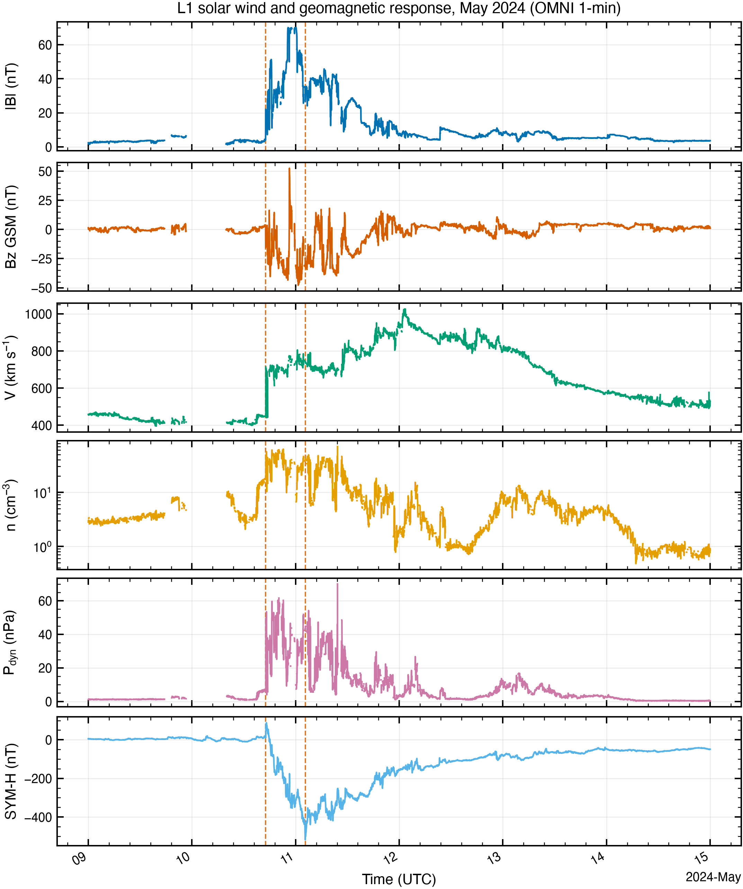
*The standard storm stack: |B|, Bz, speed, density, pressure, SYM-H. OMNI 1-min.*


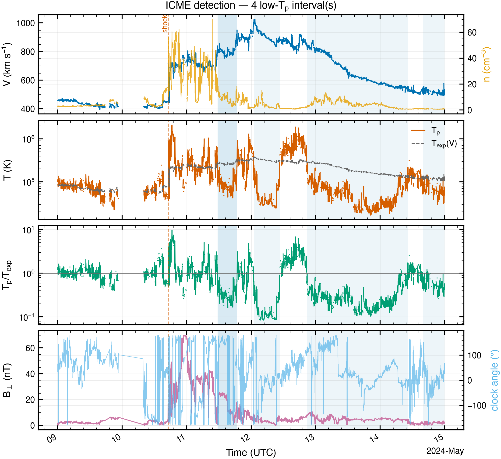
*ICME interval detection on the same series.*


### Can the storm be predicted from the solar wind?

`model_dst` runs O'Brien & McPherron (2000), pressure-corrected on hourly-averaged OMNI (audit `6f4583e4ec1d`):

- Correlation **0.965**, RMSE **48 nT**
- Model minimum **-272.9 nT** against an observed hourly minimum of -436 nT — the model **under-predicts the peak by 163.2 nT**

A correlation of 0.965 alongside a 163.2 nT miss at the peak is the honest result, and worth stating plainly: the O'Brien–McPherron coupling function was fitted on ordinary storms and saturates on this one. The shape of the storm is predictable from the solar wind; its depth, at this magnitude, is not. This test is absent from the notebook.


## 7. Where everything was — the heliospheric configuration

**The notebook's third failure.** `sm.coord_table.to_pandas()` raises, and it falls back to hard-coded text: *"STEREO-A ~25° from Earth, Solar Orbiter ~45°."* Both are wrong.

`plot_heliospheric_config` for 2024-05-10 12:00:00 UT (audit `2823a1b0d11b`) returns the table the notebook could not build:

| Body | Carrington lon (°) | Lat (°) | r (AU) | Spiral footpoint (°) | Separation from Earth (°) | Notebook |
|---|---|---|---|---|---|---|
| Earth | 306.9 | -3.14 | 1.01 | 9.849 | **0** | — |
| STEREO-A | 319.4 | -1.59 | 0.9565 | 19.11 | **12.5** | ~25 |
| Solar Orbiter | 114.5 | 7.48 | 0.6956 | 157.4 | **167.6** | ~45 |
| PSP | 42.11 | 3.63 | 0.7399 | 88.13 | **95.2** | — |
| BepiColombo | 73.96 | 2.54 | 0.374 | 97.11 | **127.1** | — |

**Solar Orbiter was on the far side of the Sun.** Its separation from Earth was not ~45° but 167.6° — an error of more than 120°, which inverts any conclusion about whether Solar Orbiter could see the Earth-directed eruptions. STEREO-A was 12.5°, half the stated value.

Note the **footpoint** column: a body's Parker-spiral footpoint is not its own longitude. Earth sits at 306.9° Carrington but is magnetically connected to 9.849° at 400 km s⁻¹. Longitudinal separation is not magnetic separation — which is why the figure is drawn twice, at nominal and storm wind speed:


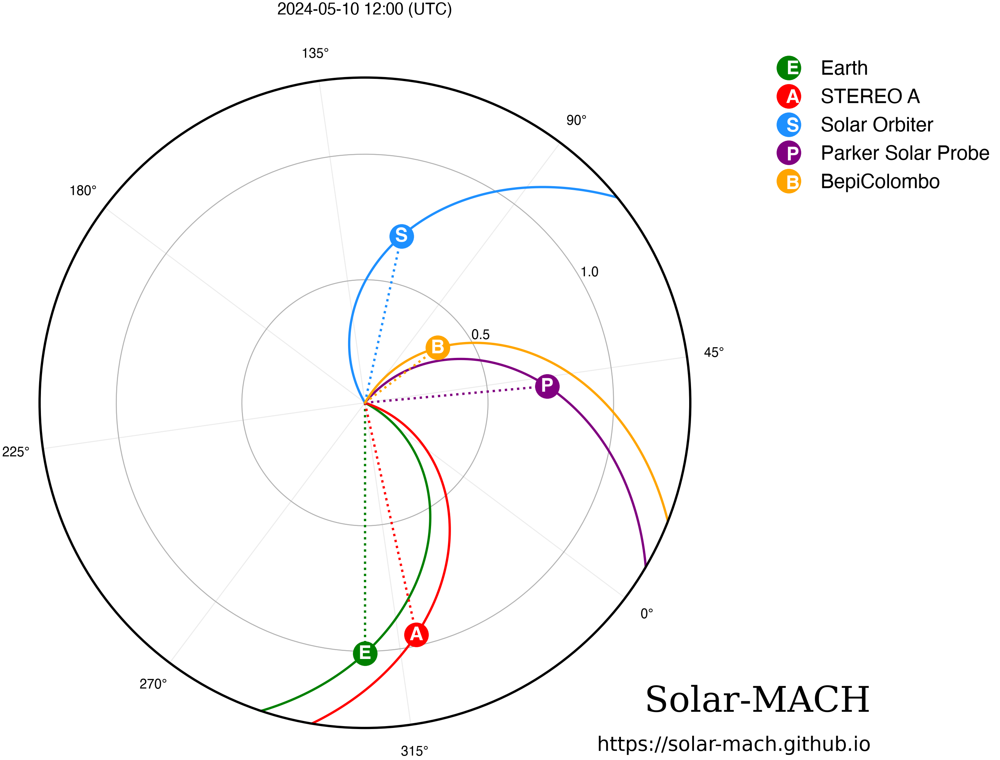
*Constellation with 400 km s⁻¹ spirals (nominal slow wind).*


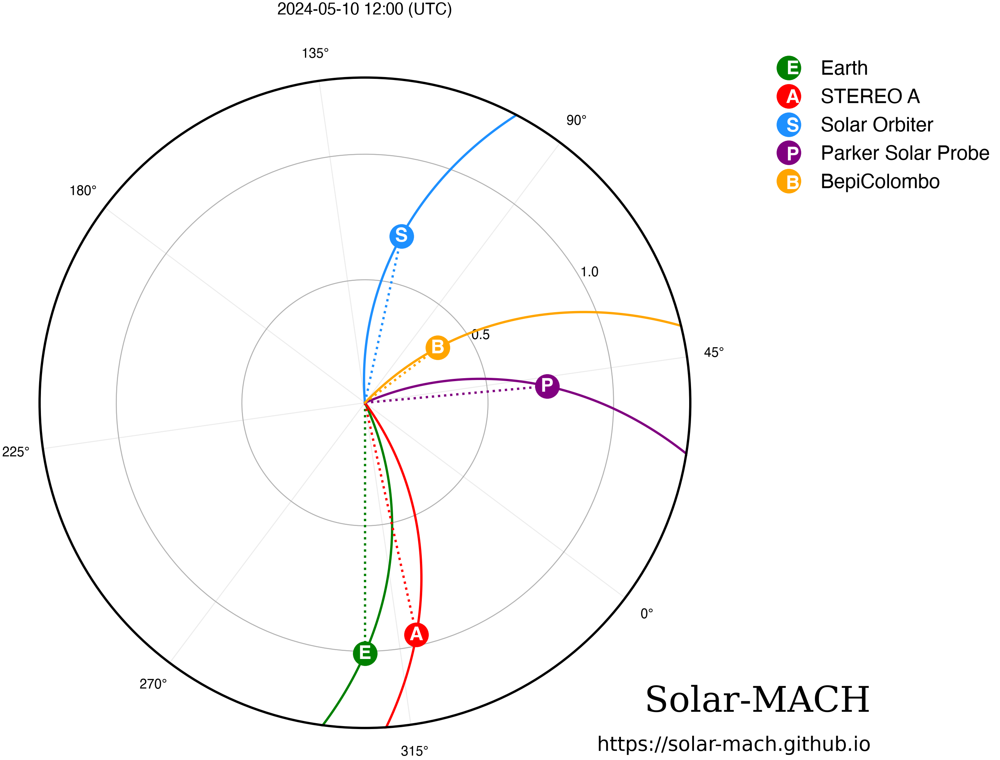
*The same instant with 1000 km s⁻¹ spirals. The spirals straighten and every footpoint moves — connectivity during the storm was not the nominal connectivity.*


Spacecraft trajectories over the same week come from `fetch_spacecraft_ephemeris` (7,801 records in Gse, audit `3450b7d437c2`).


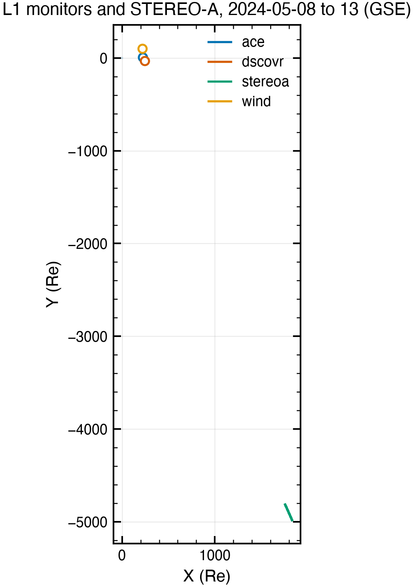
*ACE, DSCOVR, Wind and STEREO-A trajectories.*


## 8. CME arrival — forecast against observation

The notebook states arrival times without deriving them. Here the drag-based model runs on both CMEs and is scored against the shocks that were actually observed.

| CME | Launch (UT) | v₀ (km s⁻¹) | Transit (h) | DBM arrival (UT) | Window | Arrival speed | Notebook |
|---|---|---|---|---|---|---|---|
| CME 1 (05-08) | 2024-05-08 06:00 | 950 | 51 | **2024-05-10 08:57** | 2024-05-10 02:00 → 2024-05-11 12:37 | 626 km s⁻¹ | 2024-05-10 16:34 |
| CME 2 (05-09) | 2024-05-09 10:00 | 1100 | 47.1 | **2024-05-11 09:08** | 2024-05-11 01:34 → 2024-05-12 15:08 | 653 km s⁻¹ | 2024-05-10 22:21 |

Model: drag-based model (Vrsnak et al. 2013); typical accuracy +/- 10 h. Assumptions: ambient wind 450 km s⁻¹, drag Γ = 2.00e-08 km⁻¹, launched from 21.5 R⊙ (audits `28a25ff129da`, `45dd05f0a5c1`). The v₀ values are the notebook's own stated speeds, used here as inputs so the forecast is compared on its terms.

**Observed shocks at Earth** (DONKI IPS, audit `a2373869bc59`): 2024-05-10T16:36Z, 2024-05-11T09:30Z, 2024-05-11T20:30Z, 2024-05-12T08:55Z.

The first observed shock arrives ahead of both DBM point estimates but inside both stated windows. That is the expected failure mode for a compound event: the DBM propagates one CME through undisturbed wind, and here the earlier eruptions had already cleared a path for the later ones. ±10 h is the honest quote.

For context: the L1→Earth ballistic delay at 700 km s⁻¹ is **35.7 minutes** (audit `21f427571000`) — roughly the warning time the storm gave. Local plasma parameters: Alfvén speed 278.7 km s⁻¹, plasma β 0.0637, ion inertial length 41.57 km (audit `cd0c7455091a`).


## What needs updating to reproduce this notebook today

Five things in the original no longer run, or never ran:

1. **AIA through VSO times out.** The `sdo7.nascom.nasa.gov` export provider does not answer. Two routes replace it, both used here: `fetch_aia_synoptic` (JSOC synoptic archive, level 1.5 at 1024², no credentials, seconds per frame) and `fetch_aia_level1` (JSOC via `drms`, native 4096² level 1, needs a registered JSOC export email). HMI and LASCO through VSO are unaffected.
2. **The HMI flux cell raises a units error** (`'arcsec2 / pix2' and 'cm2' are not convertible`). Pixel area has to be converted through the plate scale and the solar distance before multiplying by field strength. `magnetogram_metrics` does this.
3. **`sm.coord_table.to_pandas()` raises** in current solarmach; the table is already DataFrame-like. The hard-coded values it falls back to are wrong by 120°+ for Solar Orbiter, so this failure is not cosmetic.
4. **The CME speed cell uses `np.random.uniform`** and never produced the speeds the notebook prints. Replaced here by a real measurement: `track_cme_front` locates the leading edge in each difference frame and `cme_height_time` fits it. Note the search window must open at the flare peak — C2 sees only 2.4–5.8 R⊙, so a sequence starting an hour late catches a front already leaving the field.
5. **DSCOVR plasma for 2024 is not on CDAWeb as science data** (`DSCOVR_H1_FC` ends 2019). SWPC real-time data exists, but is not science quality.

## Capabilities added to helio-agent for this reproduction

| Tool | Purpose | Validation |
|---|---|---|
| `plot_coronagraph_sequence` | Exposure-normalised running-difference panels from a coronagraph FITS sequence | `run_validation.py corona` |
| `cme_height_time` | Linear height-time fit that refuses <3 points or non-monotonic heights | `run_validation.py corona` |
| `track_cme_front` | Measures the leading edge per frame so the fit has real input; azimuthal noise reference, monotonicity-scored sector choice, explicit halo detection | `run_validation.py cmetrack` |
| `plot_heliospheric_config` | solarmach constellation and Parker spirals, returning the position table | `run_validation.py corona` |
| `fetch_aia_synoptic` | JSOC synoptic AIA (level 1.5, 1024²), replacing the dead VSO export route with no credentials needed | `run_validation.py aiasyn` |
| `fetch_aia_level1` | Native 4096² level-1 AIA from JSOC via `drms`; refuses by name without a registered export email rather than substituting the smaller product | `run_validation.py aial1` |
| `fetch_vso(detector=...)` | LASCO C2/C3 and SECCHI COR1/COR2/EUVI selection, so a sequence does not interleave two fields of view | `run_validation.py corona` |
| `fetch_vso` errors on an empty download | A provider timeout used to return `status: ok` with no files, which reads as "no such data" | — |

## Provenance

102 audited tool invocations, 95 successful. Every audit id above resolves against `workspace/logs/audit.jsonl` and can be re-executed with `uv run helio-agent replay <id>`. Regenerate with:

```bash
HELIO_AGENT_USER=cayoung uv run python \
  users/cayoung/analyses/2024-05-gannon-notebook-repro/reproduce.py
HELIO_AGENT_USER=cayoung uv run python \
  users/cayoung/analyses/2024-05-gannon-notebook-repro/render_report.py
```

Steps that returned an error, kept in the record rather than hidden:

- `S5_dscovr_pla`: refusing: requested window 2024-05-10T00:00:00Z..2024-05-13T00:00:00Z is outside DSCOVR_H1_FC coverage 2016-06-03T00:00:00.000Z..2019-06-27T23:58:59.000Z; pick a window inside coverage or a different 
- `S2_vso_cme1_94`: VSO matched 10 record(s) but downloaded 0 files; the provider refused or timed out. For AIA the sdo7.nascom.nasa.gov export route is often unusable — use fetch_aia_synoptic instead.
- `S2_vso_cme1_171`: VSO matched 10 record(s) but downloaded 0 files; the provider refused or timed out. For AIA the sdo7.nascom.nasa.gov export route is often unusable — use fetch_aia_synoptic instead.
- `S2_vso_cme1_304`: VSO matched 10 record(s) but downloaded 0 files; the provider refused or timed out. For AIA the sdo7.nascom.nasa.gov export route is often unusable — use fetch_aia_synoptic instead.
- `S2_vso_cme2_94`: VSO matched 60 record(s) but downloaded 0 files; the provider refused or timed out. For AIA the sdo7.nascom.nasa.gov export route is often unusable — use fetch_aia_synoptic instead.
- `S2_vso_cme2_171`: VSO search returned no records
- `S2_vso_cme2_304`: VSO search returned no records

