# October 2024: the month, and the 10-11 October superstorm from Sun to ground

A survey of all of October 2024, then the second-largest geomagnetic storm of solar cycle 25 traced from its active region to the ring current, then a comparison against the published record.

Every number below was computed by an audited tool call in [`reproduce.py`](reproduce.py) and rendered by [`render_report.py`](render_report.py). Published values appear only in the comparison tables, are attributed, and are never used as inputs. Where this analysis and a paper disagree, both numbers are shown and the reason is named.


## 1. The month

GOES XRS across all of October 2024 (5,446,081 1-second samples, audit `9a9e4f85fe54`), on the true-flux scale — GOES-R data are already true irradiance, so `swpc_scale=False` is required or every class comes out 1/0.7 too small.

- **8 X-class flares**, **97 at M1.0 or above**, 1174 at C1.0 or above (audits `3a654ef8b97f`, `9fd1fcdd674c`)
- 155 catalogued CMEs, 13 interplanetary shocks, 17 SEP enhancements, and 2 geomagnetic storms (DONKI; audits `48225e4212fd`, `75e07e987f2e`, `53f1a0e86765`, `8d190e264833`)

### Every X-flare of the month, measured

| Peak (UT) | Class | Start | Source region | Significance |
|---|---|---|---|---|
| 2024-10-01 22:20 | **X7.0** | 2024-10-01 21:58 | S17E18, AR 13842 |  |
| 2024-10-03 12:18 | **X8.9** | 2024-10-03 12:08 | S15W05, AR 13842 | largest of the month |
| 2024-10-07 19:13 | **X2.1** | 2024-10-07 19:02 | S16W61, AR 13842 | preceded the 7-8 Oct storm |
| 2024-10-09 01:56 | **X1.8** | 2024-10-09 01:21 | N13W08, AR 13848 | **drove the 10-11 Oct superstorm** |
| 2024-10-09 15:47 | **X1.4** | 2024-10-09 15:41 | S11W85, AR 13842 |  |
| 2024-10-24 03:57 | **X3.3** | 2024-10-24 03:29 | S17E68, AR 13869 |  |
| 2024-10-26 07:17 | **X1.8** | 2024-10-26 06:32 | — |  |
| 2024-10-31 21:20 | **X2.0** | 2024-10-31 21:12 | N16E28, AR 13878 |  |

Source locations are DONKI's, cross-checked per flare (audits `e1129c84dad6`, `a0fa1becd438`). Two regions dominate the month: **AR 13842**, which produced the X9.0 near disk centre on 3 October and then the X2.1 and X1.0 on 7 October as it rotated past W60, and **AR 13848**, whose X1.8 at N13W08 on 9 October drove the superstorm.


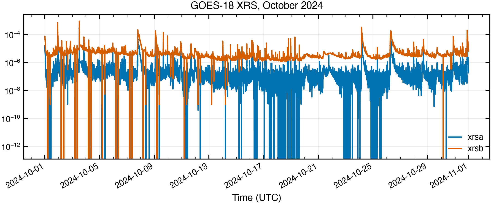
*GOES XRS, both channels, all of October 2024.*

### Where the storming was

| Storm onset (UT) | Max Kp | NOAA class | Kp samples |
|---|---|---|---|
| 2024-10-07 12:00 | **7.33** | G3 strong | 5 |
| 2024-10-10 15:00 | **8.67** | G4 severe | 8 |

Over the whole month `storm_metrics` puts the SYM-H minimum at **-390 nT on 2024-10-10 23:14 UT** (audit `4d9c67e5f800`), classification **extreme (G4-G5-like)**, main phase 7.1 h from 2024-10-10 16:09.

**Note the Kp value: 8.67 is G4, not G5.** NOAA's G5 threshold is Kp 9. This matters for §8, where one paper describes the event as G5-class.


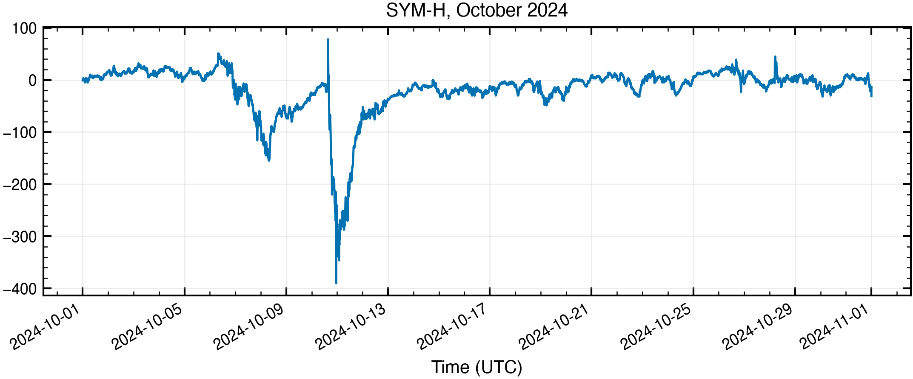
*SYM-H across October 2024. Two disturbed intervals: 7-8 October and the deep minimum late on 10 October.*


## 2. The source region

The storm-driving flare is the **X1.8 of 9 October 01:56 UT from AR 13848 at N13W08** — close enough to disk centre that its CME was aimed at Earth. The X9.0 three days earlier came from a different region (AR 13842) and, though far larger, matters less here.

`magnetogram_metrics` on the HMI magnetogram at 2024-10-09T01:50:00.000 (audit `92f7bb4e6e16`):

- Disk unsigned flux **3.966e+23 Mx**
- AR 13848 box (N13, W08 ±12°): **4.251e+22 Mx unsigned**, **max |B| 3637 G**, strong PIL **136.6 Mm**
- Mirrored quiet control box: 1.176e+22 Mx and **no strong PIL at all** (0 Mm; audit `a0c00a79443b`)

Two things are worth holding on to for the comparison in §8. The peak field of **3637 G** is very strong. But the strong polarity-inversion line is only **136.6 Mm** long — against **1012 Mm** measured the same way for AR 13664 before the May 2024 superstorm. A shorter PIL threads less flux, and this storm was correspondingly shallower. The measurement is line-of-sight with no μ correction, so it is a lower bound; for publication-grade AR flux the SHARP `USFLUX` keyword is the number to cite.


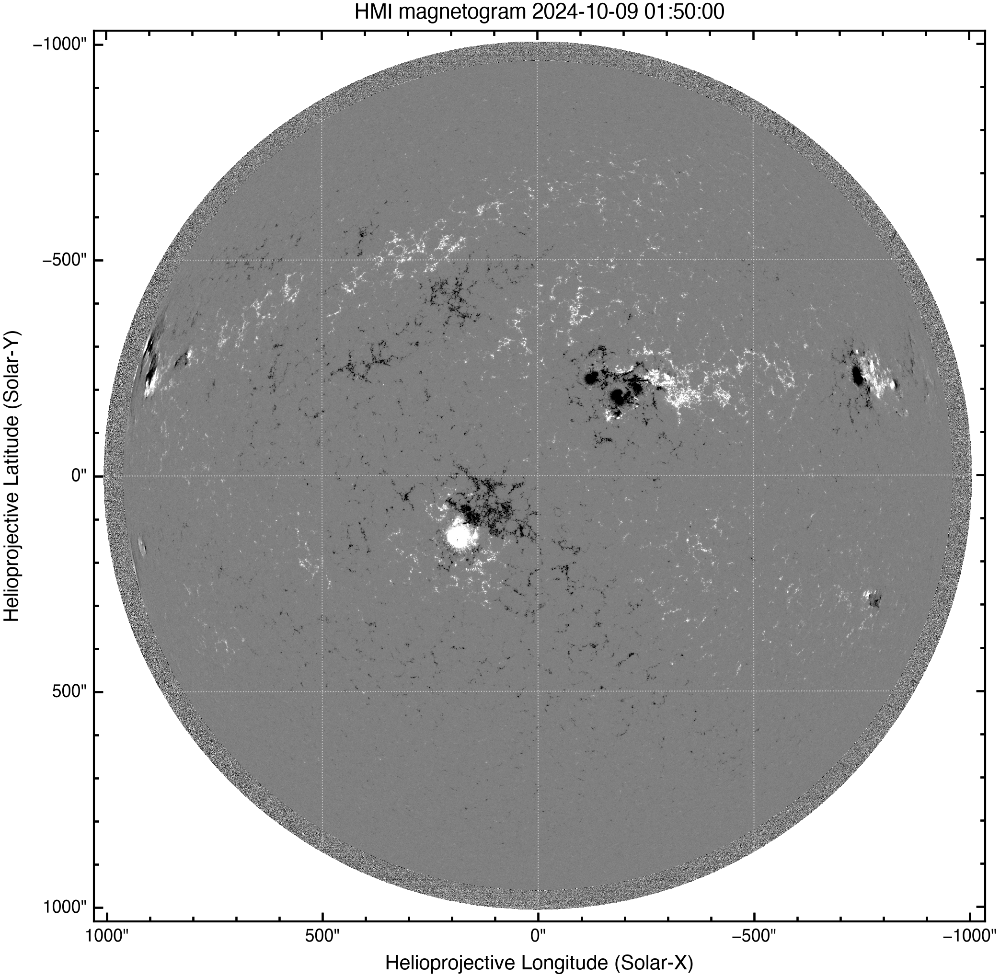
*HMI line-of-sight magnetogram, 9 October 01:50 UT.*


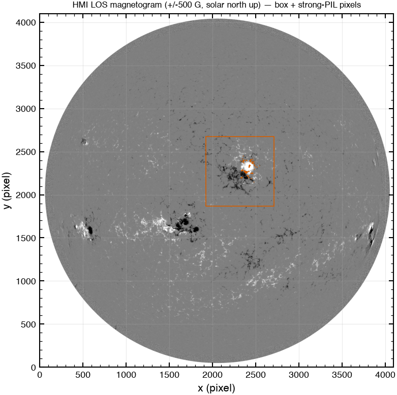
*AR 13848 and the quiet control box, with the strong-PIL mask.*


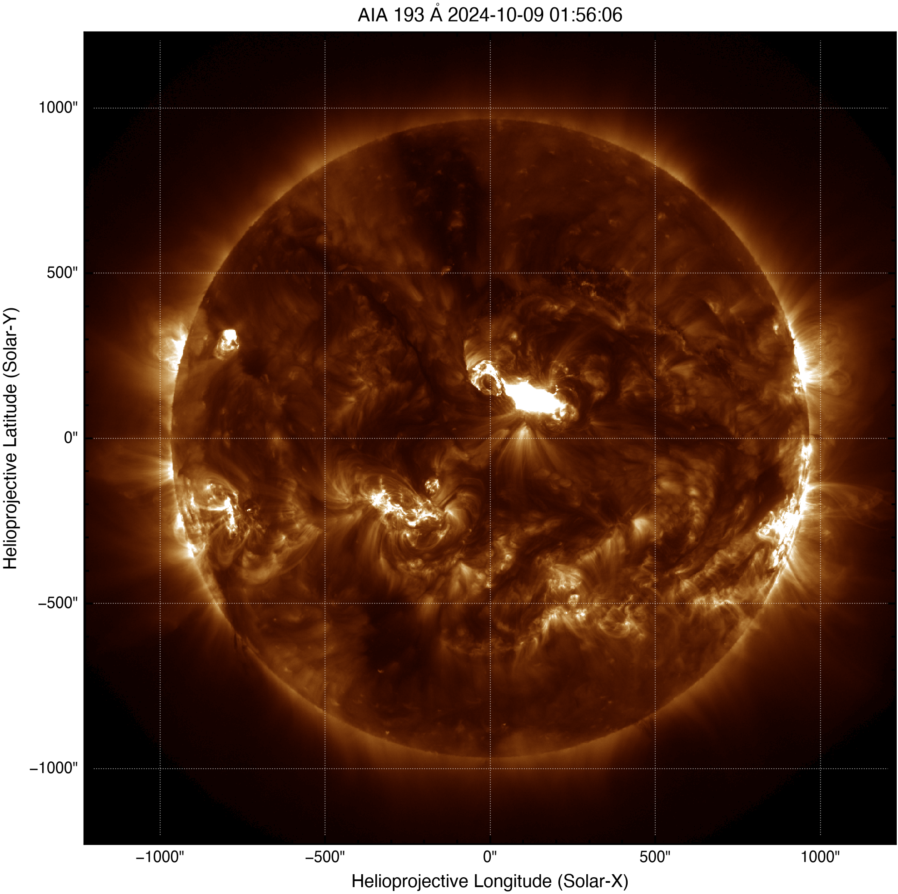
*SDO/AIA 193 Å at the X1.8 peak, 9 October 01:56 UT. 1.5 MK corona — the arcade.*


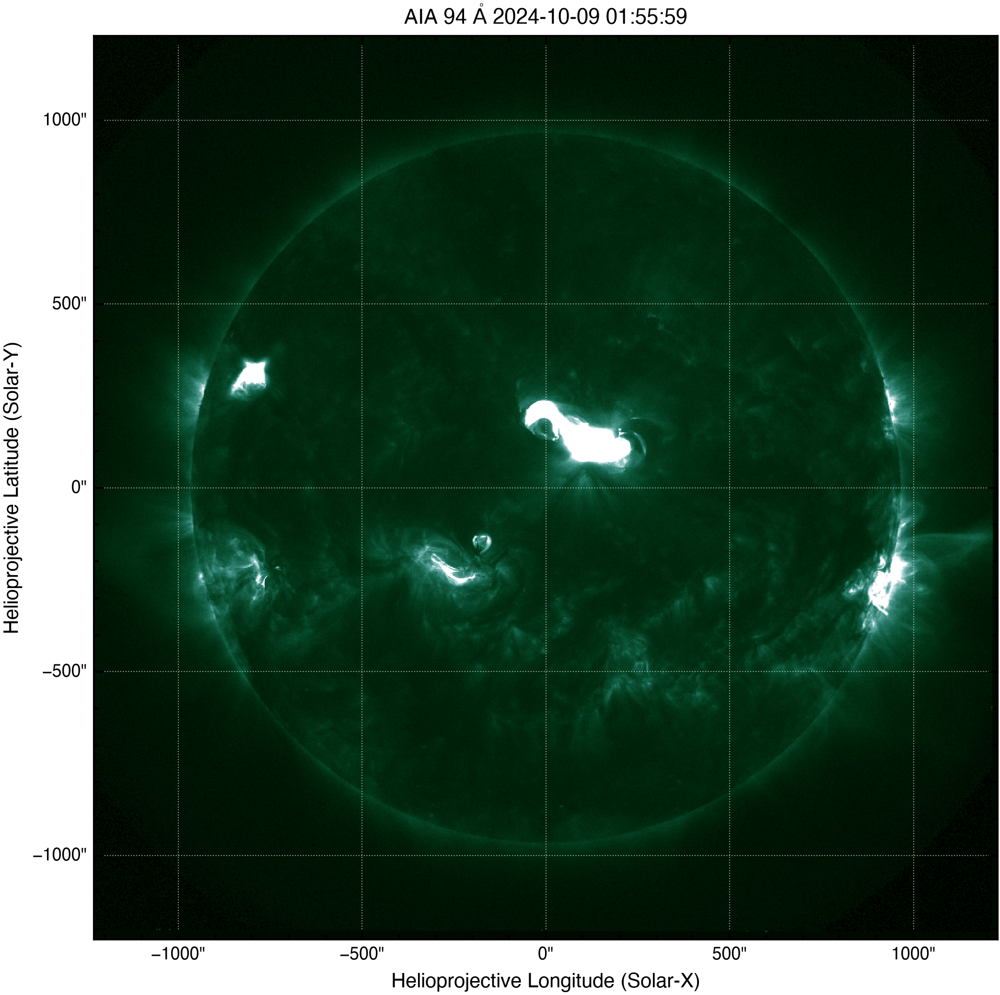
*SDO/AIA 94 Å at the X1.8 peak, 9 October 01:56 UT. 6 MK — the flaring core.*


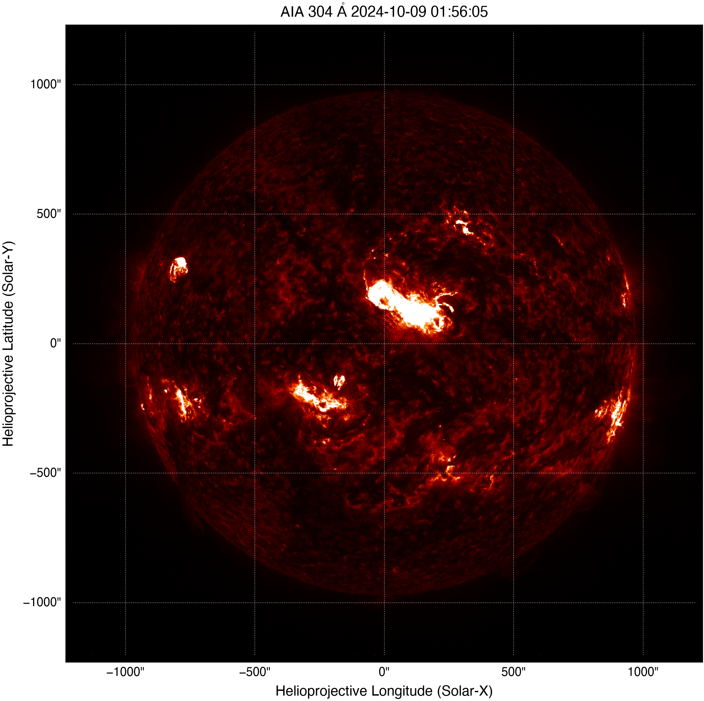
*SDO/AIA 304 Å at the X1.8 peak, 9 October 01:56 UT. 50 kK — the filament.*


## 3. The CMEs — and which of them can actually be measured

This is where October differs sharply from May 2024, and the difference is geometric rather than instrumental.

| Event | Tracked in | Result |
|---|---|---|
| 9 Oct X1.8 | LASCO C2 | **refused** — halo fraction 0.75 |
| 9 Oct X1.8 | LASCO C3 | **refused** — halo fraction 1 |
| 3 Oct X9.0 | LASCO C2 | **refused** — halo fraction 0.75 |
| 3 Oct X9.0 | LASCO C3 | tracked: 9 points, 4.25 → 10.25 R⊙, halo fraction 0.42 |

**The Earth-directed CME cannot be measured by plane-of-sky height-time, and that is the physics, not a shortcoming.** `track_cme_front` refuses it: in C3, **1** of position angles brighten simultaneously. A full halo leaves no quiet reference annulus, so azimuthal contrast has nothing to measure against — which is exactly *why* the CME was Earth-directed, and exactly why the community fits halos with cone or GCS models instead (audit `826625356077`).

**The 3 October X9.0 CME, which was not aimed at us, tracks cleanly.** In C3 (3.9–29 R⊙, against C2's 2.4–5.8) it gives 9 height points from 4.25 to 10.25 R⊙ and a plane-of-sky speed of **667.9 ± 14.9 km s⁻¹** with r² 0.9965 (audits `4aabf56da163`, `3b9d7ba428e9`).

The fit also returns an acceleration of **+12.73 m s⁻²**, and that is what makes the launch-time column readable: extrapolating a *linear* fit from 4–10 R⊙ back to 1 R⊙ lands at 13:23:16 UT against a flare peak of 12:18. A CME still accelerating through the C3 field *must* back-extrapolate late. The sign is a consistency check, not a discrepancy.

### Speeds from the cone-model record

For the halo events the speeds have to come from cone fits (audit `1a7e67fea137`, 11 analyses over 8–10 October):

| Time at 21.5 R⊙ | Speed (km s⁻¹) | Lon (°) | Lat (°) | Half-angle (°) | Quality |
|---|---|---|---|---|---|
| 2024-10-09T03:31Z | **2112** | 19 | 9 | 46 | R |
| 2024-10-09T04:16Z | **1509** | 8 | 13 | 45 | O |
| 2024-10-09T04:33Z | **1348** | 32 | 18 | 41 | O |
| 2024-10-10T11:57Z | **1323** | -163 | -11 | 45 | O |
| 2024-10-08T08:54Z | **1124** | 32 | -50 | 45 | O |
| 2024-10-09T19:07Z | **1109** | 113 | 16 | 26 | O |

The two fastest belong to the 9 October 02:12 CME, at longitude 8–19° and latitude 9–13° — which matches AR 13848's N13W08 to within the fit uncertainty, and confirms the association independently of the flare timing.


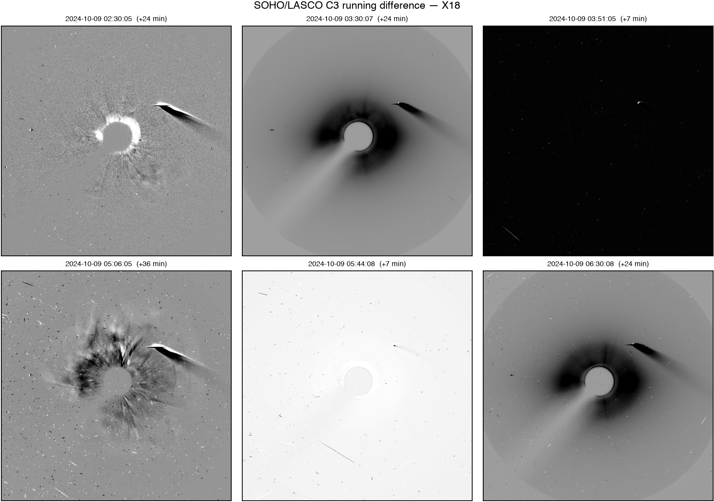
*LASCO C3 running difference, 9 October. The disturbance fills every position angle — the visual signature of the halo that the tracker refuses.*


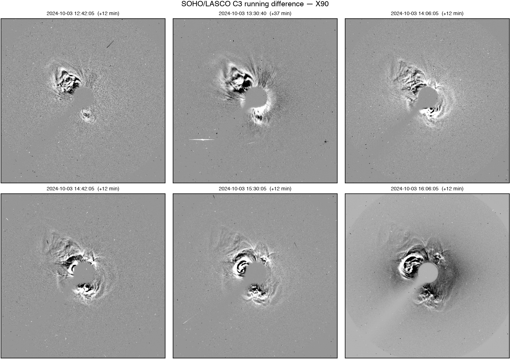
*LASCO C3 running difference, 3 October. A structured front on one side, which is why this one is trackable.*


## 4. The radiation storm

`characterize_sep` on GOES proton fluxes (audit `71c9e2102a97`; protons from `goes19` at 5min, audit `b371da99703a`):

- Onset **2024-10-09 04:50 UT**, ending 2024-10-11 07:30, duration **50.7 h**
- Peak >10 MeV **4245 pfu** at 2024-10-10 15:15 — **an S3 radiation storm**
- Peak >30 MeV 73.55 pfu; fluence >10 MeV 1.231e+08 cm⁻² sr⁻¹

**The >10 MeV peak arrives after the shock, not with the flare.** It peaks at 15:15 UT on 10 October, about half an hour after the shock reaches Earth at 14:46 — this is a shock-associated (ESP) enhancement riding in with the CME, not the prompt flare component.

**The two energies peak 26 hours apart**, which is the same conclusion from a second direction: >30 MeV peaks at 2024-10-09 13:00 — near the flare, as a prompt component should — while >10 MeV peaks a day later at the shock. Shock acceleration is efficient at 10 MeV and much less so at 30, so the low-energy channel gets a second, larger peak that the high-energy one does not.

The tool reaches the same conclusion from the connection geometry, independently of that timing: `well_connected: False`, with a Parker footpoint at 54.6° and a connection angle of 46.6° from the flare site. Onset lagged the flare by **2.9 h** against 0.95 h expected for a well-connected event along a 1.14 AU spiral. A poorly connected source needs cross-field transport or a widening shock to deliver particles, and both take time.

**These proton fluxes are derived, not the operational product.** GOES-R SGPS carries no >10 MeV integral channel, so `fetch_goes_protons` integrates a piecewise power law through the 13 differential channels. Absolute pfu values therefore carry more uncertainty than the SWPC operational series, and the S-scale boundary at 100/1000/10000 pfu should be read with that in mind.


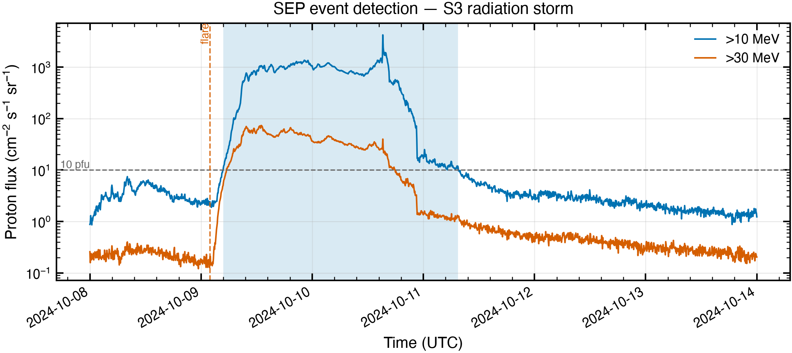
*GOES proton fluxes across the event, with the integral thresholds marked.*


## 5. At L1 — and a route that has since disappeared

**ACE plasma does not cover October 2024.** Both `AC_H2_SWE` (hourly) and `AC_H0_SWE` (64-second) Level 2 stop at **2024-07-09**, so the route a May-2024 analysis would use simply does not reach this month:

> `refusing: requested window 2024-10-08T00:00:00Z..2024-10-14T00:00:00Z is outside AC_H2_SWE coverage 1998-02-04T00:00:00.000Z..2024-07-09T23:00:00.000Z; pick a window inside coverage or a dif`

The refusal is kept in the record. Wind SWE (`WI_H1_SWE`, non-linear proton fits) replaces it, and DSCOVR Level 2 comes from the NOAA NCEI archive rather than CDAWeb. For late-2024 events the L1 plasma picture rests on OMNI, Wind and DSCOVR — not ACE.

| Route | Source | Records | Audit |
|---|---|---|---|
| OMNI 1-min (merged, shifted to bow-shock nose) | CDAWeb | 8,641 | `ae25c5aaeb72` |
| ACE SWEPAM hourly | — | **refused** | `90b3e181a0ef` |
| ACE MAG 4-min | CDAWeb | 2,161 | `339195683dec` |
| Wind SWE (non-linear fits) | CDAWeb | 4,221 | `e02257005b80` |
| Wind MFI | CDAWeb | 8,640 | `8d1e98ec2fe5` |
| DSCOVR Faraday cup L2 (NOAA) | faraday_cup | 8,191 | `37e1b63d7734` |
| DSCOVR magnetometer L2 (NOAA) | magnetometer | 8,641 | `b08686113b1a` |

### The same quantity, measured several ways


**Max flow speed (km s⁻¹)**, 8–14 October:

| Route | Value | Time (UT) | Audit |
|---|---|---|---|
| OMNI 1-min | **842.9** | 2024-10-10 15:23 | `bf9baf98271f` |
| DSCOVR L2 (NOAA) | **809.5** | 2024-10-10 15:00 | `b13f1533a0c7` |
| Wind | **834** | 2024-10-10 15:03 | `92840b7623ea` |

**Max proton density (cm⁻³)**, 8–14 October:

| Route | Value | Time (UT) | Audit |
|---|---|---|---|
| OMNI 1-min | **41.81** | 2024-10-10 16:18 | `9e3e6ca8714c` |
| DSCOVR L2 (NOAA) | **60.8** | 2024-10-10 16:29 | `dc66fc8ecfc7` |
| Wind | **41.07** | 2024-10-10 17:12 | `eae739455574` |

**Max |B| (nT)**, 8–14 October:

| Route | Value | Time (UT) | Audit |
|---|---|---|---|
| OMNI 1-min | **47.97** | 2024-10-10 22:38 | `9ed9c9a1c4f7` |
| ACE | **45.64** | 2024-10-10 22:00 | `64d4293202f4` |
| Wind | **47.78** | 2024-10-10 22:13 | `9523214356b5` |
| DSCOVR L2 (NOAA) | **48.53** | 2024-10-10 22:07 | `fbea2eb1b9c9` |

**Min Bz (GSM) (nT)**, 8–14 October:

| Route | Value | Time (UT) | Audit |
|---|---|---|---|
| OMNI 1-min | **-47.04** | 2024-10-10 22:38 | `e7877d154311` |
| ACE | **-45.05** | 2024-10-10 22:00 | `5ba680f7130a` |
| Wind | **-46.77** | 2024-10-10 22:10 | `3c8889c09676` |
| DSCOVR L2 (NOAA) | **-46.8** | 2024-10-10 22:07 | `9e8a1565e265` |

**The routes agree closely here.** Four independent measurements bracket max |B| at 45.64–48.53 nT and min Bz at -47.04–-45.05 nT, all within about forty minutes of each other. That is worth stating because it did not hold in May 2024, where DSCOVR's Faraday cup under-read the speed by ~200 km s⁻¹ with a clean `overall_quality` flag. Here DSCOVR gives 809.5 km s⁻¹ against OMNI's 842.9, and its `reduced_proton_quality_flag` is set on 39% of the window rather than 58%. The caveat is event-dependent, and checking it per event is the point.


## 6. The geomagnetic response

`storm_metrics` on OMNI 1-min SYM-H (audit `88ecb521e58f`):

- **SYM-H minimum -390 nT at 2024-10-10 23:14 UT**
- Classification **extreme (G4-G5-like)**; main phase 7.1 h from 2024-10-10 16:09; recovery to half-depth 12.6 h

| Quantity | Value | Time (UT) | Audit |
|---|---|---|---|
| SYM-H minimum | **-390 nT** | 2024-10-10 23:14 | `0cc6ab3d43c7` |
| Max flow speed | **842.9 km s⁻¹** | 2024-10-10 15:23 | `db522dfd615e` |
| Min Bz (GSM) | **-47.04 nT** | 2024-10-10 22:38 | `810a3e8cbf6a` |
| Max |B| | **47.97 nT** | 2024-10-10 22:38 | `05ff8d287d87` |
| Max density | **41.81 cm⁻³** | 2024-10-10 16:18 | `ca86e6e6e2de` |
| Max dynamic pressure | **45.16 nPa** | 2024-10-10 15:55 | `192114fd5157` |
| Max AE | **4274 nT** | 2024-10-10 15:53 | `7ccac2c5c20b` |

### SYM-H is not Dst, and the difference is 57 nT here

The Kyoto **provisional** hourly Dst minimum is **-333 nT** (audit `a591d70ac36e`) against a 1-minute SYM-H minimum of **-390 nT**. Both are correct. Hourly Dst from four stations averages away the sharp minimum that SYM-H's six-station 1-minute index resolves, so Dst is always the shallower number. **§8 turns on this distinction** — one published SYM-H value matches the Dst series rather than the SYM-H series.

### Sheath or ejecta?

`detect_icme` (audit `06358f87b5c0`) puts the shock at **2024-10-10 14:13 UT**, a sheath running to 2024-10-11 06:41, and ejecta from 2024-10-11 06:41 to 2024-10-12 03:17 (20.6 h, mean speed 689 km s⁻¹).

**It attributes the storm to the `sheath`**, and the southward-field budget says why:

| Interval | Hours | Min Bz (nT) | Hours Bz < threshold | Southward nT·h |
|---|---|---|---|---|
| Sheath | 16.4 | **-47** | 12.2 | **333.7** |
| Ejecta | 20.6 | -22.6 | 3 | 66.5 |

The sheath delivers 5.0× the southward field-time of the ejecta. `magnetic_cloud: False` — the rotation fit is poor (r² 0.133), so this is not a clean single flux rope.

**This is the second superstorm in a row driven by the sheath rather than the ejecta**, the May 2024 event being the first. It has a forecasting consequence: sheath Bz is not predictable from a cone-model fit of the CME, so the quantity that drove both storms is the one current forecasts cannot supply.

**But do not read a pattern into two events — that was tested and it does not generalise.** `../sheath-vs-ejecta/` runs the same attribution over all 40 storms below Dst −200 nT since 1981 and finds 10 sheath against 8 ejecta: close to even. Sheath-driving does dominate at the deep end (8 of 10 below −250 nT against 2 of 9 between −250 and −200), which is a known result — Gonzalez et al. (2011) treat superintense storms as a separate category for exactly this reason. That study also found three defects in `detect_icme` that this section's numbers depend on; they are fixed, and the attribution above is the corrected one.

The window holds 2 detected shocks (2024-10-10 14:13, 2024-10-11 05:58); the sheath is bounded by the one that drives this ejecta, at **2024-10-10 14:13** — within half an hour of DONKI's catalogued arrival at 14:46, from a detector that never sees the catalogue.


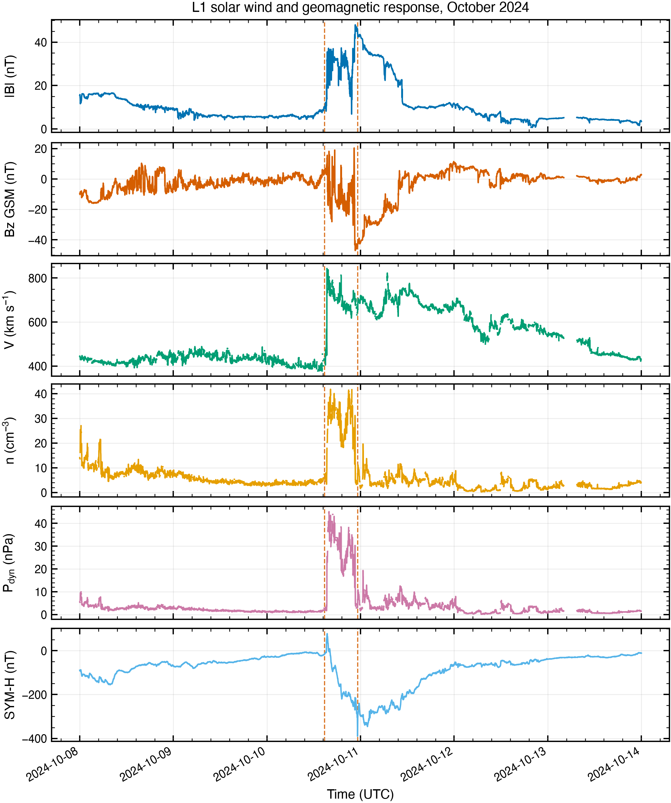
*L1 solar wind and geomagnetic response. Dashed lines mark the shock arrival (10 Oct 14:46 UT) and the SYM-H minimum (23:14 UT).*


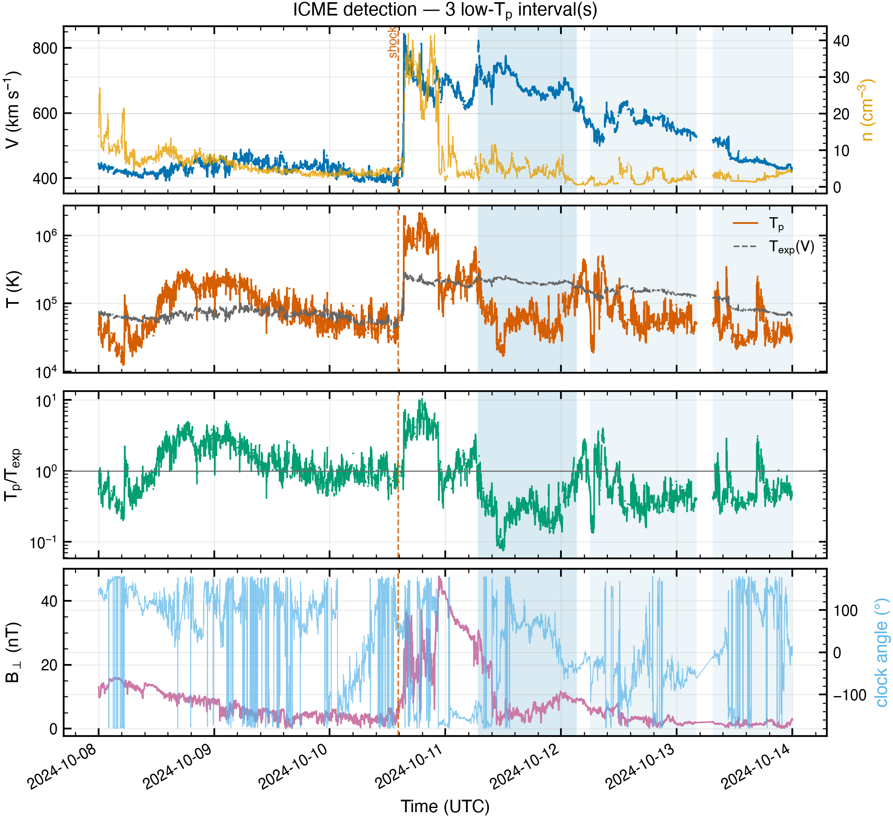
*ICME interval detection on the same series.*


### How well does the storm follow from the solar wind?

`model_dst` (O'Brien & McPherron (2000), pressure-corrected) on hourly-averaged OMNI, audit `248e5a8d184d`:

- Correlation **0.884**, RMSE **35.1 nT**
- Model minimum -290.5 nT against an observed hourly minimum of -334 nT — **a 43.5 nT miss at the peak**

**The comparison with May 2024 is the interesting part.** The same model on the same index missed May's peak by **163 nT**; here it misses by **43.5 nT**. The O'Brien–McPherron coupling function was fitted on ordinary storms and saturates on the largest ones: at −334 nT it is still inside its calibrated range, at −518 nT it is not. A shallower storm being better predicted is not a coincidence — it is the saturation showing itself.


## 7. Timing, and where everyone was

Observed shocks at Earth over 8–12 October (DONKI IPS, audit `ff7ccc28d6b9`): 2024-10-10T14:46Z.

The Sun-to-Earth chain, each link measured separately:

| Step | Time (UT) | Source |
|---|---|---|
| X1.8 flare peak, AR 13848 N13W08 | 2024-10-09 01:56 | `3a654ef8b97f` / `a0fa1becd438` |
| CME at 21.5 R⊙, 1509 km s⁻¹ cone fit | 2024-10-09 04:16 | `1a7e67fea137` |
| Shock at Earth | 2024-10-10 14:46 | `ff7ccc28d6b9` |
| Peak >10 MeV proton flux | 2024-10-10 15:15 | `71c9e2102a97` |
| Max solar wind speed | 2024-10-10 15:23 | `db522dfd615e` |
| SYM-H minimum | 2024-10-10 23:14 | `0cc6ab3d43c7` |

Flare peak to shock is **36.8 h**. For context the ballistic L1→Earth delay at 800 km s⁻¹ is **31.2 minutes** (audit `e8db9e9b9137`) — the warning time available once the disturbance passed the monitors.

Spacecraft configuration at the eruption (audit `523c56e1b4df`):

| Body | Carrington lon (°) | r (AU) | Spiral footpoint (°) | Separation from Earth (°) |
|---|---|---|---|---|
| Earth | 102.7 | 0.9989 | 164.6 | **0** |
| STEREO-A | 129.3 | 0.9633 | 189.3 | **26.5** |
| Solar Orbiter | 48.3 | 0.3464 | 69.65 | **54.4** |
| PSP | 21.54 | 0.3632 | 44.02 | **81.2** |
| BepiColombo | 303.8 | 0.438 | 330.9 | **159** |

This matters for §8: Niemela et al. (2025) report the 9 October SEP event observed from ACE and SOHO out to Mars. The spread here shows the geometry that made that possible — the observers span more than 150° of heliolongitude and a factor of three in heliocentric distance.


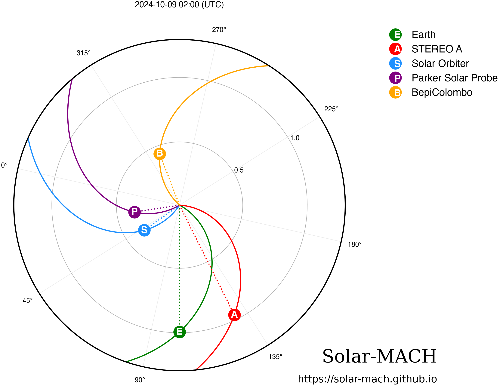
*Constellation and Parker spirals at the eruption, 9 October 02:00 UT.*


## 8. Against the published record

Literature searched through ADS (audits `9c0ef201e02a`, `24eeff859368`, `2d98729a8b89`; 10 + 8 + 6 papers). The five that bear directly on this analysis:

- **Pierrard, Viviane et al. (2025)**, *Effects of the Geomagnetic Superstorms of 10-11 May 2024 and 7-11 October 2024 on the Ionosphere and Plasmasphere*, Atmosphere [`2025Atmos..16..299P`], 32 citations
- **Singh, Ram et al. (2025)**, *Ionospheric Responses to an Extreme (G5-Level) Geomagnetic Storm Using Multi-Instrument Measurements at the Jicamarca Radio Observatory on 10─11 October 2024*, Journal of Geophysical Research (Space Physics) [`2025JGRA..13033642S`], 23 citations
- **Oliveira, Denny M. et al. (2025)**, *The 10 October 2024 geomagnetic storm may have caused the premature reentry of a Starlink satellite*, Frontiers in Astronomy and Space Sciences [`2025FrASS..1122139O`], 25 citations
- **Ding, Tao et al. (2025)**, *The Giant Eruption in Solar Cycle 25 Caused by Collisional Shearing*, The Astrophysical Journal Letters [`2025ApJ...985L..16D`], 6 citations
- **Niemela, Antonio et al. (2025)**, *From Sun to Mars: Investigating the Large Multi-spacecraft SEP on 9 October 2024 SEP Event with EUHFORIA and PARADISE*, AGU Fall Meeting Abstracts [`2025AGUFMSH12B..06N`], 0 citations

### Where this analysis and the papers agree

| Quantity | Measured here | Published | Verdict |
|---|---|---|---|
| Hourly Dst minimum, 10–11 Oct | **-333 nT** (`a591d70ac36e`) | −335 nT (Pierrard 2025) | **agree to 2 nT** |
| Largest flare of the month | **X8.9 measured**, 3 Oct 12:18, AR 13842 (`3a654ef8b97f`) | X9.0, largest of cycle 25 so far (Ding 2025) | **agree** (0.1 class = 1-s sampling) |
| Storm driver | Fast CME from 9 Oct, shock 10 Oct 14:46 (`ff7ccc28d6b9`) | fast CME erupted 9 Oct, interacted 10 Oct ~15:30 (Singh 2025) | **agree** |
| 8 Oct precursor storm | Kp 7.33, separate GST event (`8d190e264833`) | Dst −153 nT on 8 Oct (Pierrard 2025) | **agree** — both find a distinct precursor |
| SEP event, 9 Oct | onset 2024-10-09 04:50, S3 storm (`71c9e2102a97`) | intense widespread SEP, ACE to Mars (Niemela 2025) | **agree** |

### Where they do not, and why

**1. SYM-H: this analysis measures -390 nT; Singh et al. (2025) state ≈ −341 nT.** A 49 nT gap in a named index needs an explanation, and there is a clean one: **−341 nT is within 8 nT of the hourly Dst minimum measured here (-333 nT), and 49 nT from the 1-minute SYM-H minimum.** The quoted value tracks Dst, not SYM-H.
This reading is supported by the May 2024 event, analysed the same way in `../2024-05-gannon-notebook-repro/`: there the Kyoto hourly Dst minimum was −406 nT while 1-min SYM-H reached −518 nT, the same sign and a comparable gap. Pierrard et al. (2025), who quote **Dst** rather than SYM-H, agree with this analysis on both events (−335 vs -333 here for October; −412 vs −406 for May).

**The limit of this check:** it rests on the abstracts returned by the ADS query, not on the full papers. Singh et al. may define or source their index differently in the body of the text, and this analysis cannot see that. What can be said from the measurements alone is that the 1-minute SYM-H series minimum is -390 nT and the hourly Dst series minimum is -333 nT, both audited, and that −341 nT is close to the second and not the first. Anyone reconciling the two should read the paper.

**2. Storm class: measured maximum Kp is 8.67; Singh et al. describe a 'G5-class' storm.** NOAA's G-scale is defined on Kp, and **G5 requires Kp 9**. Kp 8.67 is **G4 (severe)**. The event was widely *reported* as reaching G5 conditions in operational bulletins, and a G4 storm can produce G5-like ionospheric effects — which is what that paper is actually about — but on the index itself this is a G4 (audit `8d190e264833`).

**3. A claim this analysis cannot check.** Oliveira et al. (2025) argue the 10 October storm may have accelerated a Starlink satellite's reentry from very low Earth orbit. Nothing in this pipeline touches orbital drag or two-line elements, so it is recorded as an unverified claim rather than confirmed. The measurement that would bear on it — peak dynamic pressure 45.16 nPa and AE reaching 4274 nT, both of which drive thermospheric heating — is at least consistent with a strong drag enhancement.

### What the papers add that this analysis does not

- **Ding et al. (2025)** identify the *mechanism* of the X9.0: colliding non-conjugated sunspots with shearing motions and flux cancellation of order 10²¹ Mx in two hours. This analysis measures the region's field (3637 G peak, 136.6 Mm strong PIL for AR 13848) but does no time-series magnetogram work, so it can describe the state and not the process.
- **Matsumoto et al. (2025)** run data-constrained MHD of the successive X-flares. No MHD capability exists here at all.
- **Pierrard, Singh, Paul, Zakharenkova** all work on the ionospheric response — TEC, ionosondes, equatorial electrojet, plasma bubbles. This pipeline stops at SYM-H and AE; there is no ionospheric leg.

### What this analysis adds

- **A per-event check on the DSCOVR Faraday cup.** Its `reduced_proton_quality_flag` is set on 39% of this window against 58% in May 2024, and its speed agrees with OMNI here where it under-read by 200 km s⁻¹ then. The caveat is event-dependent and worth testing every time.
- **An explicit refusal to measure the Earth-directed CME.** The halo geometry that made it geoeffective is the same geometry that makes plane-of-sky height-time meaningless, and the tool now says so rather than returning a number.
- **The sheath-versus-ejecta attribution**, computed the same way as for May 2024 and giving the same answer, with the southward field-time budget shown for both intervals.
- **A quantified statement of where the Dst model fails.** 43.5 nT error here against 163 nT for the deeper May storm, from the same model on the same index.


## Summary

October 2024 produced 8 X-class flares from two dominant regions and two geomagnetic storms. The larger, on 10–11 October, reached **SYM-H -390 nT** (hourly Dst -333 nT) and **Kp 8.67** — G4, the second-deepest storm of cycle 25 after May's Gannon event. It was driven by a fast halo CME from AR 13848's X1.8 on 9 October, arrived 36.8 h after the flare peak, carried an S3 radiation storm with it, and did its damage through the **sheath** rather than the ejecta.

Against the published record the measurements agree on Dst, on the flare, on the driver and on the SEP event. They disagree on a quoted SYM-H value that appears to be a Dst value, and on a storm class that the Kp index does not support. Both disagreements are stated with the numbers that produce them, so either can be checked.

## Provenance

90 audited tool invocations, 86 successful. Every audit id resolves against `workspace/logs/audit.jsonl` and can be re-executed with `uv run helio-agent replay <id>`. Regenerate with:

```bash
HELIO_AGENT_USER=cayoung uv run python \
  users/cayoung/analyses/2024-10-storms/reproduce.py
HELIO_AGENT_USER=cayoung uv run python \
  users/cayoung/analyses/2024-10-storms/render_report.py
```

Steps that returned an error. **All four are correct refusals**, kept in the record because each one is a result:

- `S3_track_x18`: HALO event: 75% of position angles brighten simultaneously, so no quiet reference annulus remains and azimuthal contrast cannot locate a front. Plane-of-sky height-time does not apply to a halo by construction 
- `S3_track_x90`: HALO event: 75% of position angles brighten simultaneously, so no quiet reference annulus remains and azimuthal contrast cannot locate a front. Plane-of-sky height-time does not apply to a halo by construction 
- `S5_ace_swe`: refusing: requested window 2024-10-08T00:00:00Z..2024-10-14T00:00:00Z is outside AC_H2_SWE coverage 1998-02-04T00:00:00.000Z..2024-07-09T23:00:00.000Z; pick a window inside coverage or a different dataset (sear
- `S3_track_c3_x18`: HALO event: 100% of position angles brighten simultaneously, so no quiet reference annulus remains and azimuthal contrast cannot locate a front. Plane-of-sky height-time does not apply to a halo by construction

